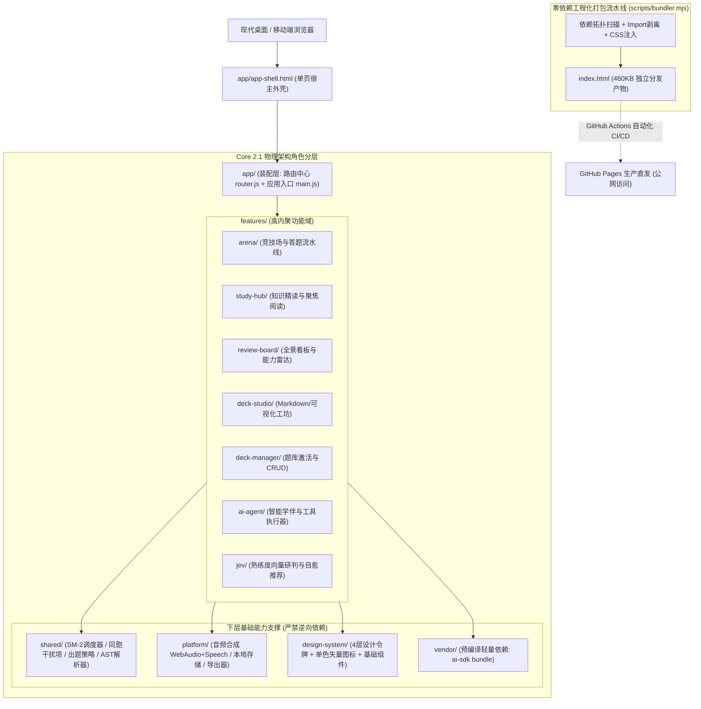

<div align="center">

# Knowledge Arena (QuestionBank)

**通用知识图谱游戏化记忆引擎与科学对战系统**  
*基于 SM-2 艾宾浩斯记忆调度、3D 知识本体架构与 AI Agent 驱动的零后端纯前端独立应用*

<p>
  <a href="#对比优势">对比优势</a>
  •
  <a href="#核心特性">核心特性</a>
  •
  <a href="#系统架构">系统架构</a>
  •
  <a href="#在线体验">在线体验</a>
  •
  <a href="#快速上手">快速上手</a>
  •
  <a href="#题库规范">题库规范</a>
  •
  <a href="#质量门禁">质量门禁</a>
  •
  <a href="#本地开发">本地开发</a>
</p>

[](./docs/09_FRONTEND_ARCHITECTURE_AND_PHYSICAL_LAYOUT.md)
[](./docs/20_ZERO_BACKEND_PURE_CLIENT_STANDALONE_SPEC.md)
[](./shared/sm2-scheduler.js)
[](./gates/run-gates.mjs)
[](https://csvkse.github.io/QuestionBank/)
[](LICENSE)

[🌐 在线直接试玩 (GitHub Pages)](https://csvkse.github.io/QuestionBank/) · [📑 文档体系全景目录](./docs/README.md) · [🚀 版本演进专栏](./docs/optimizations/README.md) · [📦 独立单文件产物 (index.html)](./index.html)

</div>

---

## 项目简介

**Knowledge Arena** 是一个专为 **高趣味性、低认知负担、科学抗遗忘与零运维部署** 场景打造的通用知识图谱对战与记忆引擎。

传统的背诵与记忆工具（如 Anki 闪卡或常规选择题刷题库）普遍面临着 **卡片单调缺乏心流激励、干扰项机械粗糙容易蒙对、过度依赖中心化云端服务器、数据受限于厂商格式** 等痛点。

Knowledge Arena 将认知心理学原理（布鲁姆认知阶梯、艾宾浩斯遗忘曲线、SuperMemo SM-2 间隔复习算法）与现代化游戏机制深度融合，采用 **Core 2.1 零后端纯前端独立单文件架构 (Zero-Backend Pure Client)**，彻底消除了对服务器进程和数据库的依赖：
- **双击即用 / 离线运行**：单个 460KB 的 `index.html` 即可独立承载全套应用逻辑与完整内置题库，无网络环境照常运行。
- **三维知识本体模型**：解耦 `Group（业务大组）× Category（分类小类）× Layer（认知层级 1/2/3）`，支持任意学科（英语、医学、编程、法律、通识）一键接入。
- **动态科学干扰项生成**：依托同胞干扰项采样数学模型与形态责任链管道，自动生成极具迷惑性的同类高诱惑候选项，彻底终结“排除法蒙题”。
- **原生多模态视听反馈**：内置纯前端 Web Audio 8-bit 动感音效与 Web Speech 原生语音合成，英语及语言类题库自动朗读发音，打造听觉记忆回路。
- **内置 AI 学伴 (AI Agent)**：支持接入 DeepSeek、OpenAI、SiliconFlow、Ollama 等多平台大模型，配备 10 项标准 Function Calling 题库工具与思维链折叠，提供智能答疑、出题与知识拓展。

---

## 目录

- [对比优势](#对比优势)
- [核心特性](#核心特性)
- [系统架构](#系统架构)
- [在线体验](#在线体验)
- [快速上手](#快速上手)
  - [方式一：公网在线体验（推荐，零门槛）](#方式一公网在线体验推荐零门槛)
  - [方式二：便携单文件离线使用（随时随地）](#方式二便携单文件离线使用随时随地)
  - [方式三：本地开发者启动](#方式三本地开发者启动)
- [核心功能指南](#核心功能指南)
  - [1. 竞技场游戏模式 (Arena)](#1-竞技场游戏模式-arena)
  - [2. 知识精读中心 (Study Hub)](#2-知识精读中心-study-hub)
  - [3. 熟练度全景与 JEV 研判 (Mastery Panorama)](#3-熟练度全景与-jev-研判-mastery-panorama)
  - [4. 题库工坊 (Deck Studio)](#4-题库工坊-deck-studio)
  - [5. AI Agent 智能学伴与工具链](#5-ai-agent-智能学伴与工具链)
- [题库格式与出题策略规范](#题库格式与出题策略规范)
  - [1. Markdown AST 大纲语法](#1-markdown-ast-大纲语法)
  - [2. 认知容量黄金法则 (5-3-10)](#2-认知容量黄金法则-5-3-10)
  - [3. 四大出题策略与规约模式](#3-四大出题策略与规约模式)
- [隐私安全与数据保护](#隐私安全与数据保护)
- [质量门禁与架构治理](#质量门禁与架构治理)
- [本地开发与自动化测试](#本地开发与自动化测试)
- [项目结构](#项目结构)
- [常见问题 (FAQ)](#常见问题-faq)
- [许可证](#许可证)

---

## 对比优势

| 评估维度 | 传统闪卡软件 (如 Anki) | 常见在线刷题网站 / 题库系统 | Knowledge Arena (本项目) |
| :--- | :--- | :--- | :--- |
| **基础设施成本** | 需配置 WebDAV / 第三方云同步账号 | 需租用云服务器、MySQL 数据库及带宽费用 | **完全免费、0 维护成本**（适配 GitHub Pages 静态托管） |
| **离线与便携性** | 需安装体积庞大的本地客户端应用 | 断网即瘫痪，无法独立离线使用 | **单文件 HTML（460KB）双击秒开**，100% 离线可用 |
| **干扰项生成质量** | 多为正反翻转卡片，无动态选项 | 固定题库选项，重刷几次后靠位置记忆 | **同胞干扰项流水线**，同形态对齐+自适应退火，告别蒙题 |
| **记忆衰减模型** | 需用户主观评估“容易/困难”按键 | 简单统计对错次数，缺乏艾宾浩斯衰减 | **客观答题行为驱动 SM-2 算法**，按到期天数动态调度 |
| **知识组织维度** | 扁平标签或单一文件夹树形 | 单一章节点，缺乏认知层级纵深 | **3D 正交坐标系**（大组 Group × 细分类 Category × 认知层级 Layer 1~3） |
| **沉浸体验与音效** | 严肃枯燥，易产生背诵倦怠 | 普通表单交互，无游戏化正反馈回路 | **连击 Combo、暴击特效、8-bit 音效与 Web Speech 原生朗读** |
| **AI 增强支持** | 需付费购买三方插件，配置繁琐 | 往往需按次购买官方额度 | **自带纯前端 AI Agent**，自由填入 APIKey 即可调起大模型与工具链 |
| **架构与质量保障** | 历史代码包袱重，插件易崩 | 业务逻辑紧耦合，逆向依赖多 | **Core 2.1 规范** + **20 项架构质量硬门禁** + **11 项单元测试** |

---

## 核心特性

| 功能模块 | 对应界面入口 | 核心能力说明 |
| :--- | :--- | :--- |
| **竞技场对战** | `#/arena` | 包含 **自由自测、弱点攻坚、分层递进、极速生存** 4 大核心模式；提供血量扣除、连击暴击、全键盘操作（1/2/3/4/Enter/P/S）与题目任务醒目指令看板。 |
| **知识精读中心** | `#/study` | 3-Step 中控矩阵筛选（大组 Group ➔ 分类 Category ➔ 认知层级 Layer）；支持 **单题沉浸聚焦卡片 (Focus Reader)** 与 **卡片树下钻穿透**。 |
| **熟练度全景看板** | `#/review` | 分类板块双层层级树状全景；支持 **折叠主权记忆 (FE-PANORAMA-002)**、一键全部展开/折叠、综合掌握率、到期与错题统计及能力雷达图。 |
| **JEV 智能研判** | `#/review` 推荐看板 | 提取熟练度向量，调用远程 JEV 研判服务；内置 **本地多维加权启发式降级自愈算法**，离线或断网无缝切换，一键直达沙盒攻坚。 |
| **题库工坊** | `#/studio` | 支持 Markdown 大纲文本与可视化卡片 **双向实时编辑与双轨校验**；内置 Markdown 状态机 AST 与 5-3-10 容量硬约束防护。 |
| **AI 智能学伴** | 全局右下角浮窗 | 纯前端 Agent 循环，支持 DeepSeek、OpenAI、SiliconFlow、Ollama、Qwen 等多平台模型；内置 **10 项标准 Function Calling 题库工具** 与思维链折叠。 |
| **语言自动朗读** | 全局顶栏开关 | 基于纯前端原生 Web Speech API，毫秒级本地合成；支持语言题库自动检测，快捷键 `P` 重播，`S` 静音切换。 |

---

## 系统架构

本项目严格遵循现代化前端架构 **Frontend Architecture Core 2.1** 规范，采用单向清晰的无环物理分层结构：



---

## 在线体验

无需克隆代码或安装任何环境，直接在现代浏览器中点击访问：

👉 **[https://csvkse.github.io/QuestionBank/](https://csvkse.github.io/QuestionBank/)**

---

## 快速上手

### 方式一：公网在线体验（推荐，零门槛）
直接打开上述 [在线页面链接](https://csvkse.github.io/QuestionBank/)，所有答题进度与自定义题库均通过浏览器的 `localStorage` 与 `IndexedDB` 保存于本地，换言之，**没有任何数据会被上传至外部不可信服务器**。

---

### 方式二：便携单文件离线使用（随时随地）
1. 下载仓库根目录下的 [`index.html`](./index.html)。
2. 直接在电脑上 **双击打开** 即可运行！
3. 支持存放在 U 盘、网盘或内网笔记软件（如 Obsidian、Notion、Logseq）中嵌入调用。

---

### 方式三：本地开发者启动
如果你希望修改源代码、扩展新模式或调试组件：

```bash
# 1. 克隆仓库
git clone git@github.com:csvkse/QuestionBank.git
cd QuestionBank

# 2. 安装开发依赖 (仅用于本地开发服务器与测试门禁，打包运行 0 依赖)
npm install

# 3. 运行本地开发服务器 (支持反向代理与热预览，默认绑定 127.0.0.1)
npm start
# 或直接双击运行 start-dev.bat

# 4. 浏览器访问
http://127.0.0.1:3000
```

---

## 核心功能指南

### 1. 竞技场游戏模式 (Arena)
- **快捷键体系**：
  - `1` / `2` / `3` / `4`：快速选定对应选项答案；
  - `Enter`：提交或进入下一题；
  - `P`：重播当前题目发音；
  - `S`：一键切换发音静音状态。
- **题目醒目度看板**：考核任务（如「转化为过去分词：」）具备独立加深背景与图标标识，单词大字阶呈现，杜绝视觉焦点倒置。
- **沙盒自由定制**：在自由沙盒试炼中，可按大组（Group）自由勾选考核范围，按认知层级（Tier 1/2/3）精细过滤题目。

### 2. 知识精读中心 (Study Hub)
- **3D 矩阵联动**：左侧中控矩阵可逐级锁定「大组 ➔ 分类 ➔ 层级」，右侧即时响应呈现知识条目。
- **单题聚焦阅读 (Focus Reader)**：点击知识卡片一键呼出沉浸式三段聚焦视图（核心概念、形态变化/核心释义、双语语境与例句）。
- **遮挡自测模式**：支持一键开启遮挡，鼠标悬停或轻触揭晓答案，极速复习。

### 3. 熟练度全景与 JEV 研判 (Mastery Panorama)
- **层级折叠主权**：每个大组具备独立的折叠状态控制，系统遵循 **FE-PANORAMA-002** 规范，严格保证用户折叠/展开操作在重新渲染时 100% 幂等留存。
- **双轨智能推荐**：
  - 远程连接：可接入专属 JEV 评估接口获取专家推荐；
  - 本地自愈：未配置远程服务时，自动通过艾宾浩斯到期度与错题率多维加权矩阵输出高风险模块突击建议。

### 4. 题库工坊 (Deck Studio)
- **Markdown 大纲双向同步**：左侧编辑标准 Markdown 大纲，右侧实时解析更新可视化卡片；在右侧图形化界面增删改查条目，左侧 Markdown 实时回写。
- **一键导入与导出**：支持标准 JSON 题库包与 Markdown 笔记的导入导出，轻松备份与分享。

### 5. AI Agent 智能学伴与工具链
- **模型配置**：支持配置 OpenAI 兼容接口（DeepSeek, SiliconFlow, Qwen 等）、Anthropic Claude、Google Gemini 以及本地 Ollama。
- **10 项标准 Function Calling 工具**：
  - `search_deck_entities`：语义/关键词全文检索；
  - `get_deck_stats`：获取当前题库掌握度与到期数据；
  - `inspect_category`：深入排查某分类下全部词条；
  - `create_deck_entity` / `update_deck_entity` / `delete_deck_entity`：受管自动化管理知识卡片。

---

## 题库格式与出题策略规范

### 1. Markdown AST 大纲语法
系统使用专有的 AST 状态机解析标准 Markdown，三级标题严格映射三维知识本体：

```markdown
# 英语不规则动词与特殊形态精通库
> 适合中高考、四六级与考研英语学习者的核心动词库

## 规则变异大组
### ic特殊变k规则
#### Layer 1 (基础识记)
- **picnic** : 野餐 (过去式: picnicked, 过去分词: picnicked, 现在分词: picnicking)
- **traffic** : 交易/通行 (过去式: trafficked, 过去分词: trafficked, 现在分词: trafficking)
- **panic** : 惊慌 (过去式: panicked, 过去分词: panicked, 现在分词: panicking)

### 辅音双写规则
#### Layer 1 (基础识记)
- **stop** : 停止 (过去式: stopped, 过去分词: stopped, 现在分词: stopping)
- **plan** : 计划 (过去式: planned, 过去分词: planned, 现在分词: planning)
```

### 2. 认知容量黄金法则 (5-3-10)
为了避免用户心智认知过载，同时保障四选一同胞干扰项有足够的同级候选项，题库严格遵循 **5-3-10** 规范：
- **大类规模**：单题库分类建议在 $\le 25$ 个；
- **分层深度**：严格固定在 3 层认知深度（Layer 1 基础、Layer 2 进阶、Layer 3 掌握）；
- **桶内容量**：每个小类下条目数建议在 $4 \sim 15$ 项（硬约束：同胞候选池 $\ge 4$，不足时触发平滑退火降级）。

### 3. 四大出题策略与规约模式
系统出题引擎彻底解耦为面向对象设计模式：
- **Strategy 策略模式**：
  - `DefaultPracticeStrategy`（默认巩固策略）
  - `WeaknessAttackStrategy`（弱点攻坚策略）
  - `SteppedProgressStrategy`（分层递进天梯策略）
  - `SpeedSprintStrategy`（极速生存限时策略）
- **Specification 规约模式**：统一判定业务口径（`IsWeaknessSpec` 错题规约、`IsDueReviewSpec` 艾宾浩斯到期规约、`IsStaleSpec` 生锈规约），终结全景看板与对战逻辑冲突。
- **Pipeline 责任链管道**：同形态干扰项优先筛选 ➔ 强混淆干扰项注入 ➔ 跨类退火补偿。

---

## 隐私安全与数据保护

1. **零服务端留存**：
   项目所有配置、答题日志与个人题库仅保存在用户浏览器的 `localStorage` 与 `IndexedDB` 中。
2. **API Key 零泄露设计**：
   AI Agent 填写的各种大模型 API Key 纯前端保存在本地存储中，直接由浏览器向官方端点（或用户自定义网关）发送请求，绝不经过任何第三方服务器中转。
3. **本地开发服务监听收紧**：
   本地代理服务器 [`scripts/dev-server.mjs`](./scripts/dev-server.mjs) 默认严格绑定本机回环地址 `127.0.0.1`，仅对合法的 `http:` / `https:` 请求提供代理，严防内网渗透与局域网 SSRF 风险。

---

## 质量门禁与架构治理

本项目内置企业级质量门禁体系（Quality Gate Suite），包含 **20 项架构质量门禁** 与 **11 项自动化单元测试**：

```text
==========================================================================
  🛡️  KNOWLEDGE ARENA ARCHITECTURE & QUALITY GATE SUITE (v2.1)
==========================================================================
[PASS] FE-STRUCT-001  : Physical Owner Compliance (所有根目录完全遵从 Core 2.1 角色)
[PASS] FE-STRUCT-002  : Feature Public Entry Boundary (所有跨域调用必经 index.js)
[PASS] FE-IMP-001     : Static Import Resolution (100% 模块依赖静态可解析)
[PASS] FE-IMP-002     : Directional Invariants (底层无任何逆向反向依赖)
[PASS] FE-RES-001     : Standalone Distribution Asset (index.html 完好且独立有效)
[PASS] FE-KNOW-002    : Macro Capacity Boundary (符合 5-3-10 容量规约)
[PASS] FE-KNOW-005    : 3D Architecture Integrity (100% 具备 Group 与 Layer 属性)
[PASS] FE-KNOW-003    : Markdown AST Roundtrip Idempotency (AST 序列化双向无损幂等)
[PASS] FE-QUALITY-001 : Modular File Size Health (所有模块均严格 <=300 行)
[PASS] FE-DESIGN-001  : Design Token Completeness (设计令牌与 Surface 0~4 完备性)
[PASS] FE-NAV-001     : Single-Row Decoupled Navigation (单行导航与路由解耦)
[PASS] FE-ICON-001    : Monochrome Vector SVG Icons (100% 单色矢量 SVG 图标)
[PASS] FE-ICON-002    : Monochrome UI Chrome (零 Emoji 现代化 UI 镀层)
[PASS] FE-BIND-001    : DOM Event Handler Contract Integrity (100% 事件绑定闭环校验)
[PASS] FE-LAYOUT-001  : Router Outlet Layout Invariant (路由插槽无间隙泄露)
[PASS] FE-TYPO-001    : Agent Message Typography Invariant (消息气泡块级语义隔离)
[PASS] FE-PANORAMA-001: Panorama Group Hierarchy Invariant (大组树状层级契约)
[PASS] FE-SCROLL-001  : Router Tab Scroll-to-Top Invariant (路由切换双轨置顶)
[PASS] FE-PANORAMA-002: Collapsible Sovereignty & Render Idempotency (折叠主权与渲染幂等)
[PASS] FE-TEST-001    : Automated Unit Test Suite (11 项单元测试全量通过)
--------------------------------------------------------------------------
  Audit Summary : 20 Passed, 0 Failures | Project Status: 🟢 HEALTHY
==========================================================================
```

---

## 本地开发与自动化测试

```bash
# 运行全量架构门禁与 11 项单元测试
npm test

# 重新编译零依赖独立单文件 index.html
npm run bundle

# 启动本地开发服务与反向代理 (默认 http://127.0.0.1:3000)
npm start
```

---

## 项目结构

```text
QuestionBank/
├── .github/
│   └── workflows/
│       └── deploy-pages.yml     # GitHub Actions 自动化门禁测试、打包与 Pages 发布工作流
├── app/
│   ├── app-shell.html           # 页面 HTML 骨架外壳 (单页容器、视口与设计令牌挂载点)
│   ├── main.js                  # 应用主控制器 (模块串联、全局状态分发与事件监听)
│   └── router.js                # 单页应用哈希路由器 (分段式导航与滚动置顶支持)
├── design-system/
│   ├── components/modal.js      # 通用模态弹窗组件
│   ├── icons/                   # 100% 离线单色矢量 SVG 图标库与 Favicon 晶体
│   └── tokens/                  # 4 层设计令牌 (colors, typography, elevation, spacing)
├── features/
│   ├── arena/                   # 竞技场对战：出题驱动、沙盒配置、进度天梯、Combo 特效
│   ├── study-hub/               # 知识精读中心：3D 矩阵中控、单题沉浸聚焦阅读、卡片树渲染
│   ├── review-board/            # 熟练度全景看板：折叠层级树、掌握度雷达图、复习时间线
│   ├── deck-studio/             # 题库工坊：Markdown 大纲双向编辑器、可视化操作控制台
│   ├── deck-manager/            # 题库管理：卡包增删改查、激活切换、JSON 导入导出
│   ├── ai-agent/                # AI 智能学伴：模型预设、会话存储、10 大 Function Calling 工具链
│   └── jev/                     # JEV 研判服务：熟练度特征向量提取、智能推荐与本地降级
├── shared/
│   ├── builtin-decks.js         # 内置精选题库数据 (动词形态精通库等)
│   ├── sm2-scheduler.js         # SuperMemo SM-2 科学间隔复习与遗忘衰减调度核心
│   ├── distractor-sampler.js    # 同胞干扰项采样数学模型与自适应退火管道
│   ├── question-strategies/     # 四大出题策略 (Strategy) 与业务规约 (Specification)
│   ├── markdown-ast.js          # Markdown 大纲与 3D 题库双向 AST 状态机解析器
│   └── deck-validator.js        # 题库规范校验器与 5-3-10 容量防护
├── platform/
│   ├── audio/                   # 音频平台：Web Audio 8-bit 合成 + Web Speech 原生朗读
│   ├── storage/                 # 存储平台：localStorage 适配器与结构化存储
│   └── exporter/                # 导出平台：单文件与 JSON 本地文件导出
├── vendor/
│   └── ai-sdk/                  # 离线打包依赖：Microsoft fetch-event-source + partial-json
├── gates/
│   └── run-gates.mjs            # 架构质量治理核心：20 项质量硬门禁驱动引擎
├── tests/
│   └── unit/                    # 11 项全功能自动化单元测试套件
├── docs/                        # 完整的架构设计、故障复盘、产品决策规约文档库
├── scripts/
│   ├── bundler.mjs              # 零依赖单文件打包编译器 (编译生成 index.html)
│   ├── dev-server.mjs           # 本地轻量开发服务器与 CORS 安全反向代理
│   └── build-vendor.mjs         # Vendor 外部库轻量预打包脚本
├── favicon.svg                  # 官方知识棱晶 (Knowledge Prism) 矢量 Favicon
├── index.html                   # 自动化编译生成的独立单文件生产分发产物
└── package.json                 # 项目依赖与构建执行脚本
```

---

## 常见问题 (FAQ)

### Q1: 这个项目必须要 Node.js 才能运行吗？
**不需要。**  
Node.js 仅用于开发阶段的自动化测试门禁（`npm test`）和单文件打包（`npm run bundle`）。对于普通使用者，直接双击根目录下的 [`index.html`](./index.html) 或直接访问 [GitHub Pages 在线页面](https://csvkse.github.io/QuestionBank/)，完全不需要安装任何运行环境。

### Q2: 为什么选择纯前端独立架构而不是前后端分离？
1. **零维护与永久存活**：无需购买和维护云服务器或数据库，没有服务器宕机或欠费停机风险；
2. **绝对的数据隐私**：知识笔记和个人记忆曲线数据完全保存在自己的设备本地，永不外泄；
3. **极佳的随身便携性**：单文件仅 460KB，可以通过微信、邮件或 U 盘发送给任意学习者，随时随地开启对战。

### Q3: 为什么有的题库不会发音？
系统内置了智能语言题库检测机制：只有被标记为语言类（如动词形态、单词卡片，或包含音标/动词特征）的卡包才会自动调用 Web Speech API 朗读发音，非语言类题库（如编程、医学、法律）会自动静音，避免干扰思考。你也可以随时点击顶栏的音响图标或按键盘快捷键 `S` 手动开启或关闭。

### Q4: 如何添加我自己的学科题库？
1. 在顶部导航点击进入 **题库工坊 (Deck Studio)**；
2. 直接在左侧粘贴你的 Markdown 笔记大纲（遵循 `## [大组]` / `### [分类]` / `#### [层级]` 格式）；
3. 右侧卡片将即时生成，点击 **保存/导入到题库** 即可立即使其生效并参与对战。

---

## 许可证

本项目基于 [MIT License](LICENSE) 开源发布。
