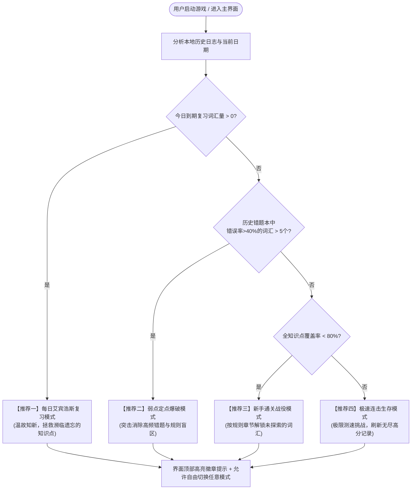

# 01. 头脑风暴与技术可行性调研报告

---

## 一、需求背景与学习痛点深度剖析

动词形态（Verb Inflection）是英语语法大厦的基石，但在实际学习中普遍存在以下三大痛点：

```
                    ┌──────────────────────────────────────────────┐
                    │               英语动词学习三大核心困境        │
                    └──────────────────────┬───────────────────────┘
                                           │
         ┌─────────────────────────────────┼─────────────────────────────────┐
         ▼                                 ▼                                 ▼
   【拼写陷阱极易混淆】              【不规则变形死记硬背】            【语法词性认知模糊】
  • -ic结尾加k (picnicking)         • AAA/AAB/ABA/ABB/ABC            • 分不清什么时候叫
  • 重读闭音节双写 (running)          分类杂乱无章，缺乏结构化归类       "现在分词" (形容词性)
  • 不发音e与ie变y (lying)          • 极易与规则变化混淆              • 什么时候叫
  • 辅音+y与元音+y的差异            • 缺乏典型模式对比                "动名词" (名词性)
```

1. **规则盲区与隐蔽陷阱**：常规教程只讲规则变化，极少系统归纳如 `picnic / panic / frolic / mimic / traffic` 变 `-ing / -ed` 必须加 `k` 这种必考特殊陷阱；双写尾字母（CVC规则）容易泛化为所有单词都双写。
2. **不规则动词认知负荷大**：将数百个不规则动词直接扔给学习者背诵，极易产生挫败感；必须将其精准解构为 **AAA (三态同形)、AAB、ABA、ABB (主流同态)、ABC (三态各异)** 五大阵营进行模式化刺激。
3. **传统刷题缺乏反馈与记忆管理**：纸质背诵或机械打卡无法精确记录错题发生率、缺乏基于时间的遗忘复习调度，导致“学了后面的忘了前面的”。

---

## 二、游戏化创意头脑风暴 (Gamification Brainstorming)

为了让语法巩固摆脱枯燥刷题感，本方案将“语法变形规则”转化为兼具操作感、成就感和智力挑战的游戏化机制：

### 1. 世界观隐喻：【时态符文师：动词形态炼金术】(The Verb Alchemist)
- **设定**：玩家扮演一名初阶时态符文师，掌握着“现在进行印记 (-ing)”、“过去完成刻印 (-ed)”、“三单共鸣 (s/es)”与“远古禁忌变形 (Irregular)”四种炼金魔法。
- **核心操作**：面对涌来的封印动词（原形），玩家需在倒计时内注入正确的形态符文，令其完成元素升华。若拼写错误或分类错误，符文发生反噬（掉血/断连击）。

### 2. 五大特色玩法头脑风暴

| 玩法创意 | 核心机制 | 对应知识点 | 游戏爽点 |
| :--- | :--- | :--- | :--- |
| **时态斩击 (Tense Slash)** | 屏幕弹出原形动词与目标形态要求（如 `panic` → 过去式），玩家在快速飘过的4个符文球中命中正确答案。 | -ic变k、双写、ie变y等拼写陷阱 | 连击 Combo、音效升调、暴击粒子、时间压迫感 |
| **阵营归宿 (Faction Slot)** | 给出动词（如 `beat` 或 `come`），玩家将其拖拽/快捷键归类到 `AAA` / `AAB` / `ABA` / `ABB` / `ABC` 能量槽中。 | 不规则动词五大分类记忆 | 模式分类直觉训练，形成条件反射 |
| **词性天平 (Grammar Balance)** | 给出句子语境，判断当前 `-ing` 形式是充当【形容词】(分词) 还是【名词】(动名词)。 | 语法词性概念辨析 | 语法深层语感觉醒，知其然知其所以然 |
| **拼写除虫猎人 (Bug Hunter)** | 系统故意给出带有经典错误的变形（如 `panicing`, `lieing`, `studyed`），玩家需挑出伪装者并一键击破。 | 常见易错拼写识别 | 纠错爽感，反向加深正确规则印记 |
| **地牢生存 Boss 战 (Dungeon Rush)** | 阶段性 Boss 战：Boss 是一连串极高错误率的顽疾单词，限定 3 次失误机会，全通关获得成就勋章。 | 个人错题本与弱项知识点 | 攻克痛点的战胜感与闭环成就 |

### 3. 高诱惑“智能干扰项发生器”设计 (Distractor Engine)
单选题如果干扰项过于荒谬（如 `run` 选项给出 `runapple`），玩家完全不需要思考语法规则。
**本项目核心优势：针对性生成符合人类高频思维盲区的陷阱干扰项！**
- 针对 `picnic (-ing)`：生成 `picnicking` (正确), `picnicing` (漏k), `picniking` (拼写变形), `picniccing` (乱双写)。
- 针对 `lie (-ing)`：生成 `lying` (正确), `lieing` (直接加ing), `lyeing` (拼写错混), `liing` (去e加ing)。
- 针对 `stop (-ed)`：生成 `stopped` (正确), `stoped` (漏双写), `stopt` (发音混淆), `stoppted`。
- 针对 `teach (过去式)`：生成 `taught` (正确), `teached` (误用规则变化), `thought` (与think混淆), `tought`。

---

## 三、技术实现方案调研与可行性对比

为了让该游戏轻量、易用、易维护，并且**完全属于用户个人私有资产**，我们对四种可能的技术架构进行了横向对比：

| 维度 | 方案 A：纯本地 Web SPA（推荐） | 方案 B：Python 终端 TUI (Textual) | 方案 C：Python 桌面 GUI (Pygame) | 方案 D：全栈 Web (Node/Python 后端) |
| :--- | :--- | :--- | :--- | :--- |
| **用户使用门槛** | ⭐⭐⭐⭐⭐<br>零依赖，浏览器双击秒开，全平台兼容 | ⭐⭐⭐<br>需安装 Python 环境及依赖库 | ⭐⭐<br>需安装环境，包体积大，易报兼容问题 | ⭐<br>需启动本地服务端，维护端口与数据库 |
| **视觉呈现与交互** | ⭐⭐⭐⭐⭐<br>现代化 CSS 动画、热力图、雷达图、响应式布局 | ⭐⭐⭐<br>字符界面美观度有限，无法做复杂图表 | ⭐⭐⭐⭐<br>游戏感强，但图表与复杂排版非常吃力 | ⭐⭐⭐⭐⭐<br>与方案 A 相同 |
| **数据持久化与隐私** | ⭐⭐⭐⭐⭐<br>本地 IndexedDB / LocalStorage，支持一键导出备份 | ⭐⭐⭐⭐<br>本地 SQLite 或 JSON 文件 | ⭐⭐⭐⭐<br>本地 SQLite 或 JSON 文件 | ⭐⭐⭐<br>依赖后端数据库，增加迁移成本 |
| **音效与反馈支持** | ⭐⭐⭐⭐⭐<br>Web Audio API 零外部音效文件，代码实时合成 8-bit 音阶 | ⭐<br>终端不支持丰富实时合成音效 | ⭐⭐⭐⭐<br>支持 Pygame.mixer，需捆绑音频资源 | ⭐⭐⭐⭐⭐<br>Web Audio API |
| **多设备支持 (PC/平板/手机)** | ⭐⭐⭐⭐⭐<br>自适应布局，手机触屏/PC键盘无缝自如 | ⭐<br>仅限 PC 终端运行 | ⭐<br>仅限 PC 运行 | ⭐⭐⭐⭐⭐<br>需配网与公网穿透才可移动端访问 |

### 架构决议：纯前端单页架构 (Vanilla Modern HTML5 / Vue3 SFC 无构建单文件 或 Vite SPA)
- **结论**：**方案 A（现代前端单页架构）在开发成本、交付便捷性、界面表现力与持久化健壮性上具备绝对优势。**
- 用户只需要保存一个包含网页资源的文件夹，双击 `index.html` 即可在 Edge / Chrome / Safari 中随时打开使用；没有任何网络请求，完全保护学习数据隐私；并且可以轻松部署为 PWA（支持离线安装到桌面/手机屏幕）。

---

## 四、数据持久化与统计运算可行性论证

### 1. 存储容量与性能可行性
- **数据量预估**：
  - 核心词库：约 150~200 个典型规则词条，JSON 体积约 **20 KB**。
  - 用户学习日志：每记录一条答题日志（时间戳、题目ID、规则ID、用户选项、耗时、对错），JSON 体积约 80 字节。
  - 用户累计练习 5,000 次，产生日志体积极限仅为 **400 KB**。
- **浏览器存储极限**：
  - `localStorage` 容量标准为 5MB；
  - `IndexedDB` 容量可达硬盘可用空间的 20%（通常数百MB至数GB）。
- **结论**：使用 `localStorage` 或 `IndexedDB` 存储学习日志完全绰绰有余，读写延时低于 2ms，完全不会卡顿。

### 2. 数据安全与跨设备流转策略
- **本地优先 (Local-First)**：所有数据默认保存在本地浏览器沙箱中。
- **一键 JSON 备份**：界面提供【导出学习数据】按钮，生成带时间戳的 `verbmaster_backup_YYYYMMDD.json` 文件。
- **一键恢复/合并**：支持导入备份文件，自动校验版本号，并支持“覆盖导入”或“增量合并”。

---

## 五、基于日期的艾宾浩斯复习算法可行性论证

用户需求中明确提出：**“能根据日期，判断知识点巩固情况，自动给出几种模式”**。

### 1. 记忆模型适配 (简化版 SuperMemo SM-2 / 艾宾浩斯遗忘模型)
传统的纯间隔记忆往往需要用户被动刷卡，我们将其转化为游戏引擎的动态数值体系：

```
                    记忆巩固等级 (Memory State Model)

  [新词 Level 0] ────(答对第1次)────► [入门 Level 1] (复习周期: 1天)
                                            │ (第1天复习答对)
                                            ▼
                                     [掌握 Level 2] (复习周期: 2天)
                                            │ (第2天复习答对)
                                            ▼
                                     [巩固 Level 3] (复习周期: 4天)
                                            │ (第4天复习答对)
                                            ▼
                                     [熟练 Level 4] (复习周期: 7天)
                                            │ (第7天复习答对)
                                            ▼
                                     [大师 Level 5] (复习周期: 15天+)
```

- **记忆衰减判定公式**：
  $$Interval(n) = \begin{cases} 1 \text{ 天}, & n = 1 \\ 2 \text{ 天}, & n = 2 \\ 4 \text{ 天}, & n = 3 \\ 7 \text{ 天}, & n = 4 \\ 15 \text{ 天}, & n = 5 \\ 30 \text{ 天}, & n \ge 6 \end{cases}$$
- **遗忘惩罚与降级**：
  - 若在复习日期到期后答错，记忆等级降回 Level 1，复习周期重置为 1 天。
  - 若逾期未复习（超期天数 > 理论周期的 2 倍），该知识点健康度提示变黄/变红（“记忆生锈”状态）。

### 2. 今日智能模式自适应推荐决策树



- **可行性评估**：前端只需在初始化加载时读取本地存储，进行一次 $O(N)$ 复杂度的数组过滤（$N < 300$，耗时小于 1 毫秒），即可瞬间给出精准的模式推荐！

---

## 六、可行性调研总结

| 评估指标 | 评估结果 | 结论说明 |
| :--- | :--- | :--- |
| **知识完备性** | 100% 覆盖 | 用户给出的所有规则（-ic变k、-ing/-ed规律、AAA/AAB/ABA/ABB/ABC、三单不规则、词性辨析）均可原子化入库 |
| **技术实现难度** | 低至中等 | 无需服务器与后端数据库，纯前端标准技术栈即可实现华丽动画、图表与数据闭环 |
| **用户体验** | 极佳 | 即开即练、键盘盲打支持、音效打击感反馈、全方位数据可视化（覆盖率、热力图） |
| **长期演进性** | 高 | 预留自定义词条导入接口、支持后续生成练习试卷或打包为离线桌面软件 |
