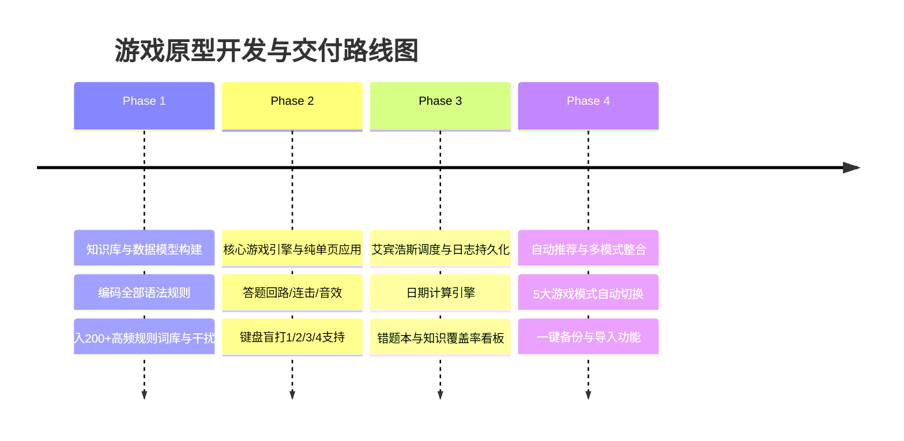

# 04. UI/UX 界面设计与交互预览方案 (UI/UX & Preview Plan)

---

## 一、视觉设计哲学与主题基调

为了彻底驱散传统背单词工具的枯燥感，界面融合 **现代科技感 (Cyber Clean)** 与 **暗色玻璃拟态 (Glassmorphism)** 风格，兼顾视觉高级感与护眼沉浸感：

- **主色调规划**：
  - 🟢 **生命与命中绿 (`#10B981`)**：正确反馈、Combo 连击累积、高熟练度掌握状态；
  - 🔴 **警戒与失误红 (`#EF4444`)**：错题警示、生命扣除、屏幕轻微抖动；
  - 🟡 **艾宾浩斯黄金 (`#F59E0B`)**：今日到期复习提示、濒临遗忘预警、星星徽章；
  - 🟣 **神秘符文紫 (`#8B5CF6`)**：不规则动词五大阵营主色、核心升级动效；
  - 🌌 **深空沉浸底色 (`#0F172A`)**：大面积护眼暗黑背景，凸显发光卡片。

---

## 二、核心界面线框原型 (ASCII Wireframes)

### 1. 界面一：主控指挥中心 (Dashboard & Mode Hub)

```text
┌────────────────────────────────────────────────────────────────────────┐
│  ⚡ VerbMaster · 时态符文殿堂              [🔥 连续打卡 5天] [👤 Lv.7 符文师] │
├────────────────────────────────────────────────────────────────────────┤
│ 📢 【智能向导推荐】                                                    │
│ ┌────────────────────────────────────────────────────────────────────┐ │
│ │ ⏰ 艾宾浩斯检测：今日有 12 个词汇到达复习节点（含 picnic, lie 等）    │ │
│ │ 👉 推荐立即开启【每日温故模式】，防止记忆遗忘衰退！    [ 一键开始 🚀 ] │ │
│ └────────────────────────────────────────────────────────────────────┘ │
│                                                                        │
│ 🎮 试炼模式选择 (Game Modes)                                           │
│ ┌──────────────────┐ ┌──────────────────┐ ┌──────────────────┐         │
│ │ 🏆 战役闯关模式  │ │ ⏰ 艾宾浩斯复习  │ │ 🎯 弱点定点爆破  │         │
│ │ • 10大渐进章节   │ │ • 今日到期: 12词 │ │ • 顽疾错题: 5词  │         │
│ │ • 解锁进度 6/10  │ │ • 待巩固黄金时机 │ │ • 专治高频陷阱   │         │
│ │ [ 继续征战 ]     │ │ [ 立即复习 🔥 ]  │ │ [ 开始清缴 ]     │         │
│ └──────────────────┘ └──────────────────┘ └──────────────────┘         │
│ ┌──────────────────┐ ┌──────────────────┐ ┌──────────────────┐         │
│ │ ⚡ 极速连击生存  │ │ 🧪 自由沙盒试炼  │ │ 💾 数据备份与恢复│         │
│ │ • 3条命限时抢答  │ │ • 自选ic/ABB分类 │ │ • 导出完整JSON   │         │
│ │ • 最高纪录 28连击│ │ • 自由打字/四选一│ │ • 导入跨设备同步 │         │
│ │ [ 挑战极限 ]     │ │ [ 自定义设定 ]   │ │ [ 管理存档 ]     │         │
│ └──────────────────┘ └──────────────────┘ └──────────────────┘         │
│                                                                        │
│ 📊 知识图谱覆盖与记忆健康度看板                                        │
│ ┌───────────────────────────┐ ┌──────────────────────────────────────┐ │
│ │ 词汇覆盖率:  82% [██████░] │ │ 📅 近30天练习打卡热力图 (Activity)   │ │
│ │ 规则掌握度:  76% [█████░░] │ │ 🟩🟩⬜🟩🟩🟩🟩⬜⬜🟩🟩🟩🟩🟩🟩🟩   │ │
│ │ 记忆健康度:  91% [███████] │ │ 累计刷题: 420 题  | 综合正确率: 88.5%│ │
│ └───────────────────────────┘ └──────────────────────────────────────┘ │
└────────────────────────────────────────────────────────────────────────┘
```

---

### 2. 界面二：对战答题竞技场 (Battle Arena)

```text
┌────────────────────────────────────────────────────────────────────────┐
│  [← 返回主页]     关卡 03: 隐秘刺客 (-ic加k特例)      进度: [8/10]      │
│  💖 💖 💖 (生命值)                 🔥 7 连击 (Combo x1.5)              │
├────────────────────────────────────────────────────────────────────────┤
│                                                                        │
│                             [ 动词原形 ]                               │
│                               panic                                    │
│                     /ˈpænɪk/  •  恐慌；使恐慌                          │
│                                                                        │
│                      ⚡ 任务：转化为【过去式 (-ed)】                    │
│                                                                        │
│   ┌──────────────────────────────┐    ┌──────────────────────────────┐ │
│   │ [1] paniced                  │    │ [2] panicked          ✨ 正确│ │
│   │                              │    │                              │ │
│   └──────────────────────────────┘    └──────────────────────────────┘ │
│   ┌──────────────────────────────┐    ┌──────────────────────────────┐ │
│   │ [3] panikking                │    │ [4] panicced                 │ │
│   │                              │    │                              │ │
│   └──────────────────────────────┘    └──────────────────────────────┘ │
│                                                                        │
│   ⌨️ 提示：按键盘数字键 [1] [2] [3] [4] 即可极速盲打！                  │
├────────────────────────────────────────────────────────────────────────┤
│ 💡 【规则溯源卡 (答完即时浮出)】                                       │
│ 规则：动词以 ic 结尾，变 -ing / -ed 时，必须先补 k，再加后缀！         │
│ 核心同伙：picnic, panic, frolic, mimic, traffic                       │
│ 记忆口诀：ic变态要加k，不然读音不对劲！                                │
└────────────────────────────────────────────────────────────────────────┘
```

---

### 3. 界面三：知识图谱雷达与错题本 (Knowledge Codex & Mistake Vault)

```text
┌────────────────────────────────────────────────────────────────────────┐
│  📚 动词形态法典与错题档案馆                      [ 筛选: 🔴 需复习 (8) ]│
├────────────────────────────────────────────────────────────────────────┤
│  [ 全部规则 ] [ -ic加k特例 ] [ 双写辅音 ] [ 不规则AAA-ABC ] [ 词性辨析 ] │
├────────────────────────────────────────────────────────────────────────┤
│  词条     原形   当前形态   遗忘状态   正确率   下次复习日期   操作      │
│  ────────────────────────────────────────────────────────────────────  │
│  picnic   picnic picnicked  🟡 到期    60% (3/5) 今日 14:00    [专项攻克]│
│  lie      lie    lying      🔴 生锈    50% (2/4) 2天前逾期     [立即强化]│
│  read     read   read(/red/)🟢 稳固    100%(6/6) 7天后        [查看详情]│
│  beat     beat   beaten     🟢 稳固    90% (9/10)12天后       [查看详情]│
│  teach    teach  taught     🟡 到期    75% (6/8) 今日 18:00    [专项攻克]│
│  be       be     is/was/been🟢 熟练    100%(5/5) 15天后       [查看详情]│
└────────────────────────────────────────────────────────────────────────┘
```

---

## 三、音效与物理打击感规范 (Sound & Juice Feedback)

为了让答题体验具有类似节奏大师或街机的爽快感，游戏通过浏览器原生 **Web Audio API** 实时合成音效，完全不依赖外部庞大音频文件加载：

| 操作触发点 | 音效参数设计 (Web Audio API) | 视觉粒子与动效 (Juice Effects) |
| :--- | :--- | :--- |
| **答对 (常规)** | 频率为 `523.25Hz (C5) → 659.25Hz (E5)` 正弦双音阶清脆拨弦 | 选项卡绿色光晕扩散，卡片微弹跳 (+4px) |
| **连击 5 连以上** | 音阶逐渐升高 (`E5 → G5 → B5 → C6`)，尾音带混响 | 屏幕顶部弹出金色火焰 Combo 飘字粒子 |
| **答错 (失误)** | `150Hz → 80Hz` 锯齿波下行蜂鸣 | 选项卡红色闪烁，界面轻微震颤 300ms |
| **通关/晋级** | 连续三和弦琶音庆祝音 | 屏幕底部喷射彩色纸屑 (Confetti Canvas) |
| **按键打字** | 轻微的机械键盘打字打簧脆响 (800Hz 极短微脉冲) | 输入框光标伴随节奏缩放 |

---

## 四、原型体验与交互预览方案规划 (Interactive Preview Plan)

为了让用户能够立刻看到并上手体验该游戏的原型，我们将采取**渐进式四阶段落地路线图**：



### 预览实现交付形态
我们将提供一个完全独立的极速体验版本，集成在项目主目录中：
1. **单一文件运行**：一个完整的 `index.html`（内嵌 HTML5 + Tailwind CSS + 原生 ES6 现代响应式状态引擎），零网络依赖，双击即玩。
2. **知识点预填充**：默认内置本提示词中的全部核心知识体系（包含 5 个 -ic 特例动词、不规则动词全套分类、三单不规则、词性辨析）。
3. **真实本地保存**：实时将练习数据存入 `localStorage`，随时关闭随时恢复。
