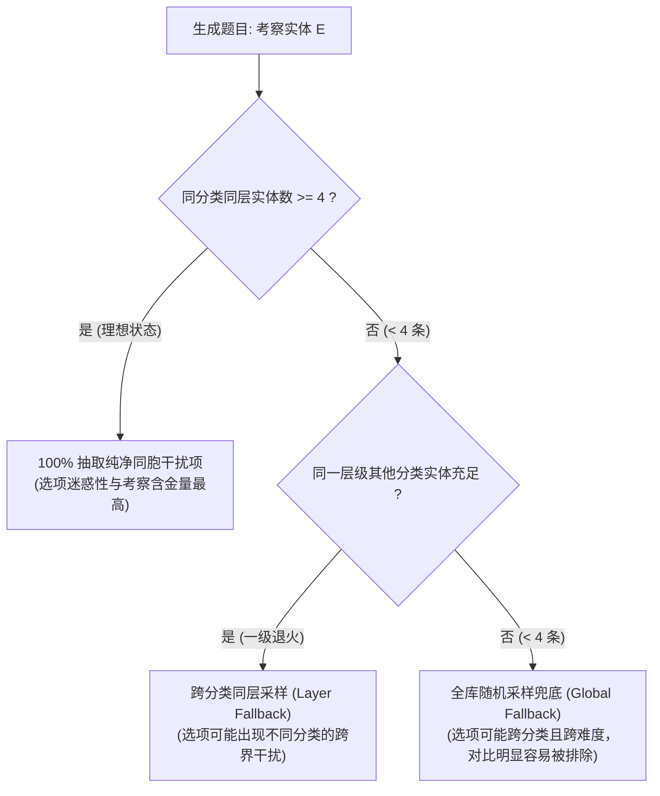

# 知识容量与分类分层极限设计规范 (Scale & Capacity Spec)

本文档针对**通用知识图谱游戏化记忆框架 (Universal Knowledge Gamification Framework)**，从认知科学（学习者心智负荷）、算法机理（同胞干扰项四选一生成）以及前端工程性能三个维度，对知识体系导入的**类型数量 (Categories)**、**分层深度 (Layers)** 和 **单层条目数 (Entities per Bucket)** 进行系统性量化与边界约束规范。

---

## 一、指标推荐矩阵与极限边界 (Specification Matrix)

| 核心指标 | 黄金推荐区间<br>(Sweet Spot) | 体验安全上下限<br>(Safe Range) | 极限边界<br>(Engineering Boundary) | 边界原因与设计机理 |
| :--- | :---: | :---: | :---: | :--- |
| **1. 分类数量 (Categories / 类型)** | **4 ～ 8 个** | 2 ～ 15 个 | **上限 30 个**<br>下限 $\ge 2$ 个 | • 超过 15 个标签栏严重折行，心智全景图割裂；<br>• 最少需 $\ge 2$ 个体现横向同胞对比。 |
| **2. 分层深度 (Layers / 层级)** | **3 层**<br>(L1/L2/L3) | 2 ～ 5 层 | **上限 5 层**<br>下限 $\ge 1$ 层 | • 超过 5 层人脑失去难度边界感知（退化为流水线）；<br>• 3 层天然契合「入门 $\to$ 核心进阶 $\to$ Boss陷阱」。 |
| **3. 单分类单层条目数 (Per Bucket)** | **6 ～ 15 条** | 4 ～ 30 条 | **硬性底线 $\ge 4$ 条**<br>软性上限 $\le 50$ 条 | • **$\ge 4$ 条是四选一生成算法的数学硬要求**；<br>• 超过 30 条滚动疲劳，应拆分为子分类。 |
| **4. 单分类总条目数 (Per Category)** | **15 ～ 30 条** | 6 ～ 60 条 | **上限 100 条** | • 超过 60 条会导致知识图谱雷达/条形图失衡。 |
| **5. 单题库总容量 (Deck Capacity)** | **50 ～ 150 条** | 20 ～ 500 条 | **技术上限 1,500 条** | • 浏览器 localStorage 配额安全与纯前端即时渲染限制；<br>• 达到 200 条以上建议创建独立新题库。 |

---

## 二、算法机理深度剖析：为什么单分类单层「至少需要 4 条」？

### 1. 同胞干扰项发生器 (Universal Sibling Distractor Synthesizer) 数学模型

在引擎生成一道标准的四选一单选题时，需要从知识库中抽取：
$$\text{题目选项集 } \mathcal{O} = \{ A_{\text{correct}}, D_1, D_2, D_3 \}, \quad |\mathcal{O}| = 4$$
其中：
- $A_{\text{correct}}$ 为当前考察知识点的标准答案；
- $D_1, D_2, D_3$ 为干扰项，必须满足 $D_i \neq A_{\text{correct}}$ 且彼此互不相同。

系统优先在**同一分类 (Same Category) 且同一层级 (Same Layer)** 的同胞集合 $\mathcal{S}_{\text{sibling}}$ 中采样：
$$|\mathcal{S}_{\text{sibling}}| \ge 4 \implies \text{无缝提取 } 3 \text{ 个同质性极高、极具迷惑性的同胞概念}$$

### 2. 数量不足时的退火降级机制 (Layer Fallback & Global Fallback)

如果某个分类或层级条目数 $< 4$ 条，算法将触发阶梯降级策略：



- **危害评估**：当发生全库退火时，比如考察 HTTP 401（未认证客户端错误），干扰项可能被随机填充为 HTTP 500（服务端错误）甚至无关概念。考生仅凭常识即可排除，题目的认知训练价值被大幅稀释。
- **强制规则**：每个分类每个层级**强烈建议录入 $\ge 4$ 个条目**（最佳为 6~15 个），避免降级退火。

---

## 三、认知科学视角的结构设计（心智负荷与游戏化节奏）

### 1. 分类的米勒定律 ($7 \pm 2$)
人类大脑在同一工作记忆视窗中，能够高效并行比对的概念群为 $5 \sim 9$ 个。
- **4 ～ 8 个分类**刚好能够铺满学习控制台的导航区域。
- 学习者在答题前能够形成宏观的**知识全景认知地图 (Holistic Mental Model)**。

### 2. 纵向分层的「认知三阶梯」
本框架将分层严格收敛至 3 层，对应游戏机制的三大核心体验：

```
┌────────────────────────────────────────────────────────┐
│  Layer 3: 盲区与特例 (Boss 陷阱)                        │ ──> 触发「👹 盲区 Boss」
│  • 反常特例、易混淆高频坑点 (如 picnic+k, 401 vs 403)     │     与「📅 艾宾浩斯」定向补漏
├────────────────────────────────────────────────────────┤
│  Layer 2: 核心规律与运用 (主干支柱)                     │ ──> 触发「⏱️ 3分钟极限排位」
│  • 进阶语法规则、核心方法辨析 (如 重读闭音节双写, 4xx)      │     日常强化记忆
├────────────────────────────────────────────────────────┤
│  Layer 1: 基础认知与常识 (基石识记)                     │ ──> 触发「⚡ 极速连击」
│  • 80% 通用常规模式 (如 规则动词+ed, 200 OK, 404)       │     建立正向反馈与连击信心
└────────────────────────────────────────────────────────┘
```

---

## 四、题库构建的「5-3-10」黄金实操指南

用户或 AI 在整理导入新题库时，建议直接套用以下标准结构：

$$\mathbf{5}\text{ 大分类} \times \mathbf{3}\text{ 级阶梯} \times \mathbf{10}\text{ 条知识} = \mathbf{150}\text{ 条黄金题库}$$

### 典型场景配比推荐表

| 场景类型 | 典型学科案例 | 推荐分类数 | 推荐层级 | 单元条目数 | 题库总容量 | 预期通关周期 |
| :--- | :--- | :---: | :---: | :---: | :---: | :---: |
| **轻量速通型** | Git 常用命令手册、Linux 基础操作 | 3 个 | 2 层 | 6 条 | **约 36 条** | 2 ～ 3 天 |
| **标准考试型** | 英语动词变位、计算机 HTTP 状态码 | 5 个 | 3 层 | 8 条 | **约 120 条** | 1 ～ 2 周 |
| **专业系统型** | 软考核心架构概念、Python 进阶原理 | 8 个 | 3 层 | 12 条 | **约 288 条** | 3 ～ 4 周 |

---

## 五、增删改查 (CRUD) 的工程约束与交互提示规范

为了保障游戏化题库的健康运行与数据完整性，系统对**题库生命周期的 CRUD** 设立了以下强制约束与反馈提示：

### 1. 增 (Create / Import) 限制与提示
- **题库名称**：必填，限制 1 ～ 30 字符，不能为空。
- **题库图标**：限制 1 个 Emoji 字符，空缺时自动回退为 📚。
- **总条目硬约束**：**至少 4 个词条**，若 $< 4$ 条则禁止保存导入（提示：`❌ 实体数量少于 4 个，无法生成四选一选项！`）。
- **总容量软警告**：单题库超过 300 条时给出优化提示（`💡 提示：条目超过 300 条，建议拆分为两个独立题库，以便更精准地利用艾宾浩斯复习算法`）。
- **同胞池实时体检 (Health Lint)**：
  - 实时扫描每一个分类；
  - 若存在条目数 $< 4$ 条的分类，给出黄色警示标牌：`⚠️ 分类「xxx」仅有 n 个条目，答题时同胞干扰项将退火降级！`；
  - 全部满足时显示绿色认证标牌：`🟢 干扰池健康度 100%`。

### 2. 删 (Delete) 限制与保护
- **系统内置题库保护**：系统内置预设（英语动词、HTTP 状态码、Python 核心）带有只读保护标记 `isBuiltin: true`，UI 上**禁用删除**，明确提示 `🔒 系统内置预设，不可删除`。
- **自定义题库二次确认**：删除自定义题库时，弹出强阻断确认对话框，明确告知所影响的**分类数、条目数与已有的刷题记录数**，必须点击确认后方可销毁。
- **分类级联删除防误触**：在 Studio 可视化编辑树中，若分类下含有条目，删除分类时必须弹窗确认：`该分类下包含 X 个条目，删除分类将同时清空这些条目，确认删除吗？`。

### 3. 改 (Update) 支持与隔离
- **支持编辑已有自定义题库**：可直接调出已有自定义题库进入 Studio，修改后原地更新覆盖，保留原有做题进度（按词条 ID 增量对齐）。
- **内置题库分叉机制 (Forking)**：若用户尝试编辑系统内置题库，系统自动提示：`🔒 系统内置题库为只读预设。修改后将自动保存为独立的“自定义副本”，原始预设不会受到任何影响。`

### 4. 查 (Read / Manage)
- 提供专门的 **「题库管理中心 (Deck Management Modal)」**；
- 一屏展现所有题库的分类数、条目数、掌握度百分比、刷题次数及健康状态指示灯（🟢/🟡/🔴）。
