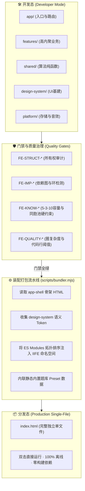

# 09. 前端架构升级与物理目录规范 (Frontend Architecture Core 2.1 Mapping)

---

## 一、架构背景与演进动因

### 1. 现状痛点分析 (Current State Analysis)
当前项目处于 **单文件单体极速原型阶段 (`index.html`，~3300行，~160KB)**。虽然单文件具备“双击即玩、零外部依赖、极致便携”的显著优点，但随着功能的不断扩充（知识精读大厅、可视化/MD双向题库工坊、题库管理器、艾宾浩斯调度引擎、Web Audio 音效合成器、AST 序列化器等），单一文件架构暴露出严重的工程缺陷：
1. **边界责任混沌 (Ownership Violation)**：应用启动装配、业务用例、持久化存储、通用算法与视觉组件杂糅在同一 `<script>` 标签内，违反了 `Frontend Architecture Core 2.1` 规定的逻辑角色边界。
2. **测试与门禁真空 (Gate Absence)**：无法对 AST 状态机、艾宾浩斯复习算法或同胞干扰项生成器进行独立的单元测试与门禁扫描；无法开展静态依赖图与循环引用审计。
3. **复杂度超标 (Quality Debt)**：单文件 3300 行代码，远超企业级架构治理中建议的 `300 行/文件` 的 Review 告警阈值。

### 2. 演进目标与核心原则
参考企业级规范 `SoftwareArchitecture/frontend`，引入 **Frontend Architecture Core 2.1** 与 **Lightweight Web Profile 1.0.0**，实现：
- **逻辑角色彻底解耦**：严格划定 `app`、`features`、`shared`、`design-system`、`platform`、`vendor` 六大核心角色。
- **双模式交付 (Dual-Mode Delivery)**：
  - **开发态 (Dev Mode)**：完全物理模块化，采用 Native ES Modules，享受极佳的可测试性、独立职责与门禁拦截。
  - **分发态 (Dist Mode)**：提供轻量零依赖打包脚本 (`scripts/bundler.mjs`)，一键自动化装配内联为单一便携式 `index.html`，**100% 保持用户喜爱的本地无服务双击运行体验**。

---

## 二、架构组合与技术配置文件 (Selected Profiles & Binding)

本项目遵循可组合的前端架构范式：

```text
Frontend Architecture Core 2.1.0
        +
UI Framework Profile: lightweight-web@1.0.0 (Native ESM, DOM Components)
        +
Runtime Profile: spa@1.1.0 (Local-First, Web Storage, Offline Capable)
        +
Project Binding: KnowledgeArena Binding 1.0.0 (Conformance: transitional -> conformant)
        +
Project Design System: CyberRetro Dark Theme 1.0.0
        ↓
Project FE-* / DS-* Executable Gates & Test Suite
```

### 项目根目录绑定配置 (`binding.yaml`)
```yaml
schemaVersion: 1

project:
  id: KnowledgeArena.Web
  bindingVersion: 1.0.0
  conformance: transitional # transitional (过渡期) -> conformant (完全合规)

framework:
  id: frontend-architecture-core
  version: 2.1.0

selectedProfiles:
  uiFramework:
    - lightweight-web@1.0.0
  runtime:
    - spa@1.1.0

projectConventions:
  designSystem:
    version: 1.0.0
    document: docs/04_UI_UX_AND_PREVIEW_PLAN.md

projectDocuments:
  architecture: docs/09_FRONTEND_ARCHITECTURE_AND_PHYSICAL_LAYOUT.md
  gates: docs/10_QUALITY_GATES_AND_GOVERNANCE_SPEC.md
  migrationPlan: docs/11_ARCHITECTURE_MIGRATION_AND_PREVIEW_PLAN.md

implementation:
  currentPhysicalModel: monolithic-single-html
  targetLogicalModel: core-2.1-modular
```

---

## 三、逻辑角色划分与职责边界 (Core Roles & Invariants)

| 逻辑角色 | 对应物理路径 | 权威职责与边界定义 | 允许依赖方向 | 严禁行为 |
| :--- | :--- | :--- | :--- | :--- |
| **`app`** | `app/` | **应用启动、路由装配与顶层 Composition**。<br>负责页面切换调度、顶层状态聚合与 App Shell 渲染。 | ➔ `features` (公开入口)<br>➔ `shared`<br>➔ `design-system`<br>➔ `platform` | 严禁编写具体的业务答题算法或题库解析逻辑。 |
| **`features`** | `features/<name>/` | **高内聚的业务领域功能模块**。<br>拥有专属页面、用例状态、局部交互组件与公开导出 `index.js`。 | ➔ 自身内部<br>➔ 其他 Feature 公开入口<br>➔ `shared`<br>➔ `design-system`<br>➔ `platform` (公开能力) | 严禁直接深层引用其他 Feature 的私有内部实现。 |
| **`shared`** | `shared/` | **跨领域稳定产品级核心能力**。<br>无单一 Feature owner，具备多个真实消费者（如艾宾浩斯调度算法、同胞干扰项采样器、Markdown AST 解析器）。 | ➔ `design-system`<br>➔ 中立工具 | 严禁依赖任何具体 Feature 业务流程；严禁注入 DOM 操作。 |
| **`design-system`**| `design-system/` | **无业务语义的 UI 基建**。<br>语义 Token（颜色、间距、字体）、暗黑主题映射、通用弹窗/按钮/药丸组件、图标规范。 | ➔ 框架/运行时中立能力 | 严禁引入题库、做题、Combo 等任何业务模型。 |
| **`platform`** | `platform/` | **底层运行环境与技术适配器**。<br>`localStorage`/`IndexedDB` 存储适配、Web Audio API 8-bit 音效合成、本地文件导入导出。 | ➔ `shared` 中立契约 | 严禁反向拥有 Feature 业务逻辑或页面路由。 |
| **`vendor`** | `vendor/` | **经核准锁定的第三方离线库**。<br>Tailwind CSS 运行时、Canvas Confetti 特效。 | ➔ 独立无依赖 | 严禁直接修改 vendor 源码。 |

---

## 四、目标物理目录结构规范 (Target Physical Layout)

```text
Game/
├─ index.html                             # 生产分发入口 (单文件便携产物，100%离线可用)
├─ binding.yaml                           # 架构绑定与版本声明契约
├─ package.json                           # 门禁与工程化统一入口脚本
│
├─ app/                                   # 【Core: app】应用总装配
│  ├─ main.js                             # 启动引导与模块注册中心 (Bootstrap)
│  ├─ router.js                           # 视图路由切换器 (arena/study/review/stats)
│  └─ app-shell.html                      # 顶层导航栏与视图挂载容器模板
│
├─ features/                              # 【Core: features】业务领域垂直划分
│  ├─ arena/                              # 竞技场刷题功能域
│  │  ├─ index.js                         # 唯一对外公开入口
│  │  ├─ quiz-runner.js                   # 答题推进状态机与倒计时
│  │  ├─ combo-effect.js                  # 连击激励与暴击特效计算
│  │  └─ styles/                          # 局部动效与战斗排版
│  ├─ study-hub/                          # 知识精读与自测大厅功能域
│  │  ├─ index.js                         # 唯一对外公开入口
│  │  ├─ matrix-console.js                # 3-Step 矩阵中控联动筛选 (Group x Cat x Layer)
│  │  ├─ tree-renderer.js                 # 3层树形卡片流式渲染
│  │  └─ mask-toggle.js                   # 答案遮挡自测逻辑
│  ├─ deck-studio/                        # 题库工坊 (可视化/MD双向联动)
│  │  ├─ index.js                         # 唯一对外公开入口
│  │  ├─ visual-editor.js                 # 可视化表单组件与数据绑定
│  │  ├─ markdown-editor.js               # Markdown 代码编辑器与双向同步
│  │  └─ lint-status.js                   # 题库健康度实时巡检报表
│  ├─ deck-manager/                       # 题库生命周期管理功能域
│  │  ├─ index.js                         # 唯一对外公开入口
│  │  └─ deck-crud.js                     # 预设防呆、原地编辑、危险删除拦截
│  └─ review-board/                       # 艾宾浩斯复习看板与雷达图
│     ├─ index.js                         # 唯一对外公开入口
│     ├─ timeline-board.js                # 复习到期时间轴与状态过滤
│     └─ radar-chart.js                   # 知识覆盖率雷达图绘制
│
├─ shared/                                # 【Core: shared】跨功能共享能力 (纯函数/可单测)
│  ├─ sm2-scheduler.js                    # 艾宾浩斯 / SM-2 记忆稳定度算法
│  ├─ distractor-sampler.js               # 四选一同胞干扰项采样器 (含退火降级)
│  ├─ markdown-ast.js                     # Markdown 题库 AST 解析与序列化器
│  └─ deck-validator.js                   # 5-3-10 容量规范与题库健康度校验
│
├─ design-system/                         # 【Core: design-system】无业务语义 UI 基建
│  ├─ tokens/
│  │  ├─ colors.css                       # 赛博朋克深色语义色板 Token
│  │  ├─ spacing.css                      # 4px 栅格间距 Token
│  │  └─ typography.css                   # 等宽代码与标题字体层级 Token
│  ├─ components/                         # 通用原子 UI 组件
│  │  ├─ modal.js                         # 统一弹窗生命周期封装
│  │  ├─ pill.js                          # 状态徽章与过滤药丸
│  │  └─ button.js                        # 交互按钮微动效与样式
│  └─ themes/dark.css                     # 暗黑主题核心变量
│
├─ platform/                              # 【Core: platform】技术与宿主适配器
│  ├─ storage/
│  │  ├─ local-storage-adapter.js         # localStorage 降级与备份适配
│  │  └─ indexeddb-adapter.js             # IndexedDB 高频日志异步持久化
│  ├─ audio/
│  │  └─ web-audio-synth.js               # Web Audio API 8-bit 合成音效引擎
│  └─ exporter/
│     └─ file-exporter.js                 # JSON 归档文件本地读写与导入导出
│
├─ vendor/                                # 【Core: vendor】第三方离线资源
│  ├─ tailwind.min.js                     # Tailwind CDN 本地缓存快照
│  └─ confetti.min.js                     # 庆祝彩带特效脚本
│
├─ gates/                                 # 【Governance】架构门禁与质量审计体系
│  ├─ run-gates.mjs                       # 门禁统一扫描执行器 (CLI 入口)
│  ├─ config.yaml                         # 门禁阈值、扫描范围与 baseline 配置
│  ├─ rules/                              # 规则定义集 (FE-STRUCT, FE-IMP, FE-KNOW 等)
│  └─ fixtures/                           # 门禁自我测试正反用例
│
├─ tests/                                 # 自动化单测与契约测试
│  ├─ unit/                               # 算法单元测试 (sm2, distractor, markdown-ast)
│  └─ integration/                        # 模块集成联动测试
│
├─ scripts/                               # 工程化与构建脚本
│  └─ bundler.mjs                         # 一键零依赖单文件打包装配器
│
└─ docs/                                  # 架构与业务设计权威文档库
```

---

## 五、双模式交付流水线设计 (Dual-Mode Delivery Pipeline)

为了在享受现代模块化开发红利的同时，彻底捍卫用户对**纯静态单文件本地运行**的刚性需求，系统设计了自动化装配流水线：



### 1. 开发态运行方式 (Native ES Modules)
开发时直接通过浏览器支持的原生 `<script type="module">` 运行：
- 每个文件保持在 50~200 行以内；
- 改动即时刷新生效，支持标准断点调试；
- 模块间通过显式 `import / export` 交互，无任何全局变量污染。

### 2. 生产分发态打包器 (`scripts/bundler.mjs`)
提供一个**零第三方依赖、纯原生 Node.js 实现的打包脚本**：
- **执行命令**：`node scripts/bundler.mjs` 或 `npm run bundle`；
- **执行时间**：$< 100\text{ ms}$；
- **产物标准**：
  1. 输出单一的 `index.html`（或 `dist/index.html`）；
  2. 依然保持纯本地无依赖特性，双击即开；
  3. 保留对 `localStorage` 的完全兼容，无缝继承历史做题存档。
