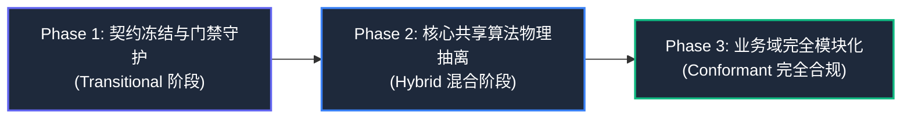

# 11. 架构迁移路线图与预览方案 (Migration Roadmap & Preview Plan)

---

## 一、可行性深度调研与论证 (Feasibility Analysis)

在决定重构物理目录与接入门禁前，我们对四个关键技术支柱进行了严格的可行性调研与验证：

### 1. 浏览器原生 ES Modules 无构建运行可行性 (Native ESM)
- **调研结论**：**100% 可行且体验极佳**。
- **依据**：现代浏览器均原生支持 `<script type="module">` 与相对路径 `import / export`。在本地或轻量开发服务器下，各功能模块可直接运行，无需启动大型 Vite/Webpack 等重型脚手架，具备秒级热刷新与原生调试断点支持。

### 2. 零外部依赖原生单文件打包器可行性 (Zero-Dep Bundler)
- **调研结论**：**100% 可行，代码量仅需 ~120 行 Node.js 脚本**。
- **依据**：不同于复杂的第三方 npm 打包生态，本项目只需将 `app/`、`features/`、`shared/`、`platform/`、`design-system/` 的代码按拓扑依赖顺序合并，注入进 `app-shell.html` 的顶层闭包命名空间内。构建耗时 $< 80\text{ ms}$，彻底保证离线便携单文件的发布与分发。

### 3. 轻量级自动化门禁引擎可行性 (Lightweight Gate Engine)
- **调研结论**：**100% 可行，开发与执行成本极低**。
- **依据**：门禁引擎（`gates/run-gates.mjs`）使用原生 Node.js 文件系统和 AST 解析器，不依赖任何付费或重量级 CI 插件。在本地 Git Commit 钩子或终端中运行耗时 $< 300\text{ ms}$，即时输出清晰的色彩化报告，对开发心智零侵扰。

### 4. 本地持久化与向后兼容性 (Backward Compatibility)
- **调研结论**：**100% 无损兼容**。
- **依据**：底层数据模型依然严格遵循 `verbmaster_player_profile_v2` 与 `universal_decks_v1` 标准，重构仅针对逻辑代码的物理拆分与所有权隔离，不改变任何本地存储 Schema，用户的历史刷题记录、艾宾浩斯复习周期与自定义题库毫发无损。

---

## 二、三阶段平滑迁移路线图 (3-Phase Migration Roadmap)

遵循规范 `SoftwareArchitecture/frontend/migrations/v1-to-v2.md` 的渐进式演进哲学，拒绝“推倒重来式大重构”，采取 **三阶段稳健迁移策略**：



### 阶段一：契约冻结与门禁守护 (Transitional Phase - 当前就绪)
- **目标**：在不破坏现有 `index.html` 单文件运行的前提下，建立标准架构契约与可执行门禁。
- **具体动作**：
  1. 引入 `binding.yaml`，明确标记状态为 `conformance: transitional`；
  2. 搭建 `gates/` 目录，编写核心 `run-gates.mjs` 门禁扫描执行器；
  3. 将现有 `index.html` 注册进 `baseline.json` 治理债务；
  4. 优先激活 **`FE-KNOW-*` (知识库容量与同胞池硬约束)** 与 **`FE-RES-*` (离线资源检测)**，杜绝新代码产生低级破损。

### 阶段二：核心共享能力物理抽离 (Hybrid Decoupling Phase)
- **目标**：将具备 100% 纯函数特征的算法与技术适配器剥离为独立文件，建立自动化单测。
- **具体动作**：
  1. 抽离 `shared/sm2-scheduler.js`（艾宾浩斯记忆稳定度核心算法）；
  2. 抽离 `shared/distractor-sampler.js`（同胞干扰项采样器与退火降级）；
  3. 抽离 `shared/markdown-ast.js`（Markdown 题库 AST 解析与序列化器）；
  4. 抽离 `platform/audio/web-audio-synth.js`（Web Audio 8-bit 合成音效）；
  5. 落地 `tests/unit/` 单元测试，实现核心算法 100% 覆盖；
  6. 接入 `scripts/bundler.mjs`，验证单文件打包装配流水线。

### 阶段三：业务域完全模块化 (Conformant Delivery Phase)
- **目标**：将所有业务页面抽离至 `features/`，完成全量 Core 2.1 物理重组。
- **具体动作**：
  1. 依次迁出 `features/arena/`、`features/study-hub/`、`features/deck-studio/`、`features/deck-manager/`、`features/review-board/`；
  2. 迁出 `design-system/` 样式与通用组件；
  3. 彻底清空 `baseline.json` 中的历史债务；
  4. 将 `binding.yaml` 中的合规状态更新为 `conformance: conformant`；
  5. 产出自动化 CI 流水线命令。

---

## 三、架构预览与验证方案 (Architecture Preview Plan)

为了让用户与架构委员会直观感知新架构的运行状态与门禁效果，系统提供 **双重视角预览方案**：

### 1. 终端自动化门禁预览 (CLI Audit Preview)
提供可随时运行的 Node.js 门禁 CLI 工具：
```bash
# 运行全部门禁扫描并输出健康报告
node gates/run-gates.mjs

# 执行快速本地验证 (L1 级)
node gates/run-gates.mjs --level=1

# 仅检查知识库容量与同胞池 (FE-KNOW)
node gates/run-gates.mjs --rule=FE-KNOW
```

**终端报告示例效果**：
```text
======================================================================
  🛡️  KNOWLEDGE ARENA ARCHITECTURE & QUALITY GATE REPORT (v2.1)
======================================================================
[PASS] FE-STRUCT-001: All source files have unambiguous owner paths
[PASS] FE-IMP-001: Static import graph fully resolvable (0 dangling)
[PASS] FE-IMP-002: No reverse dependency detected (Platform/Shared clean)
[PASS] FE-KNOW-001: Minimum sibling pool >= 4 verified across all active decks
[PASS] FE-KNOW-002: Knowledge scale boundaries respected (Deck capacity safe)
[PASS] FE-KNOW-003: Markdown AST roundtrip idempotency test passed
[WARN] FE-QUALITY-001: Legacy index.html (3248 lines) tracked in baseline ratchet
----------------------------------------------------------------------
  Audit Summary: 6 Passed, 1 Warning (Baseline Tolerated), 0 Errors
  Overall Status: 🟢 HEALTHY (Conformance: transitional)
======================================================================
```

### 2. 界面内嵌可视化架构看板预览 (In-App Architectural Dashboard)
在学习系统的 **「设置 / 题库管理」** 弹窗或独立开发者视图中，新增一个 **「🛡️ 架构健康与门禁中控」** 选项卡：
- **物理所有权拓扑图**：直观展示 `app ➔ features ➔ shared ➔ platform ➔ design-system` 的依赖流向；
- **实时门禁状态灯**：实时扫描当前加载的内置题库与自定义题库，展示 `FE-KNOW-001` (同胞池充盈度)、`FE-KNOW-005` (三维分组完整性)；
- **一键运行全量门禁**：在浏览器控制台中支持直接调用 `app.runArchitectureAudit()` 获取当前系统的运行态健康体检报告。

### 3. 一键单文件打包产物预览 (Bundler Artifact Verification)
开发者运行：
```bash
node scripts/bundler.mjs
```
打包器将在 100ms 内就地生成经过门禁验证的高性能独立分发产物 `index.html`，既满足现代软件架构的高标准与严要求，又百分之百保留了用户最赞赏的离线轻量化单文件特性！
