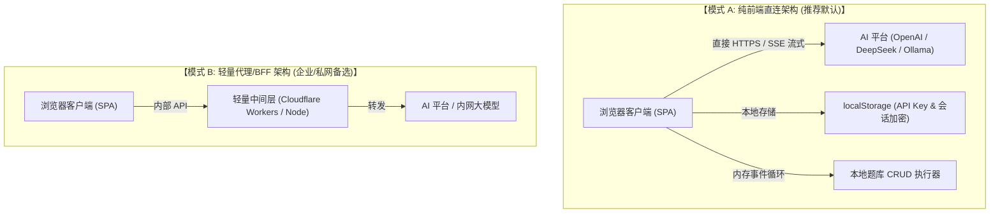
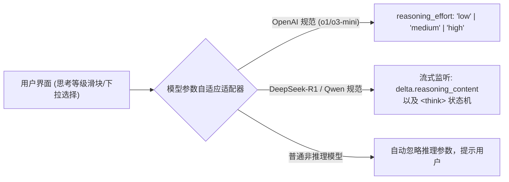
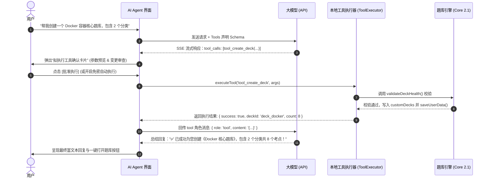
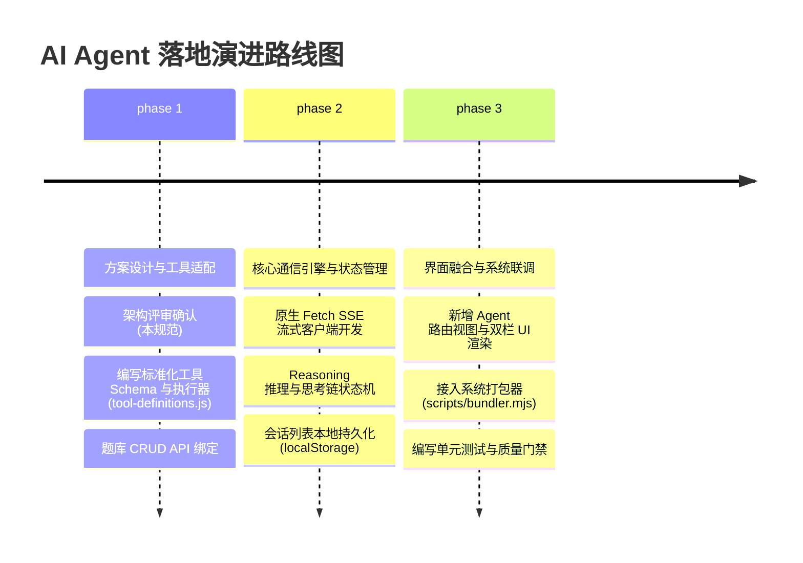
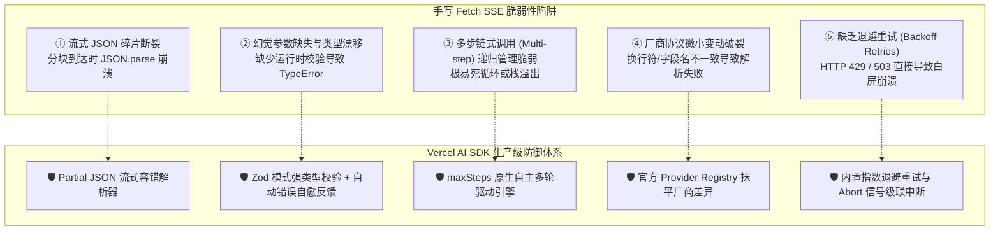
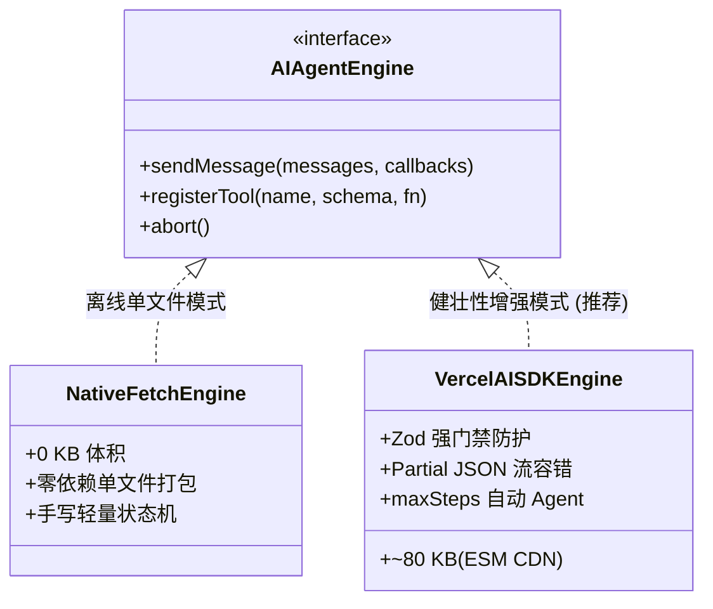
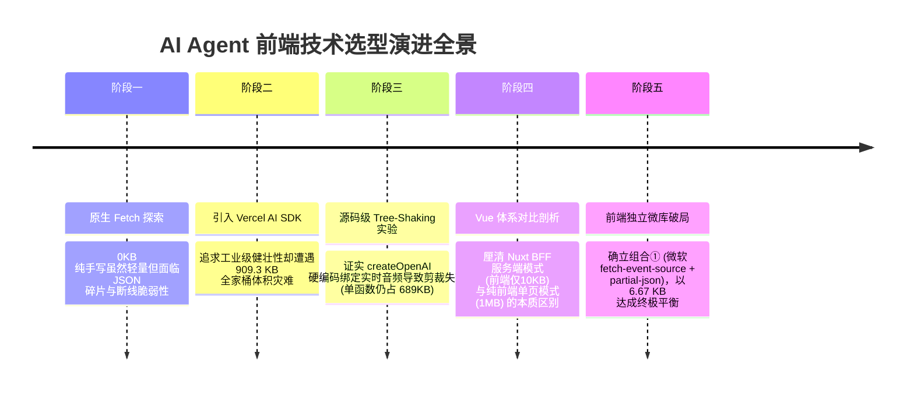
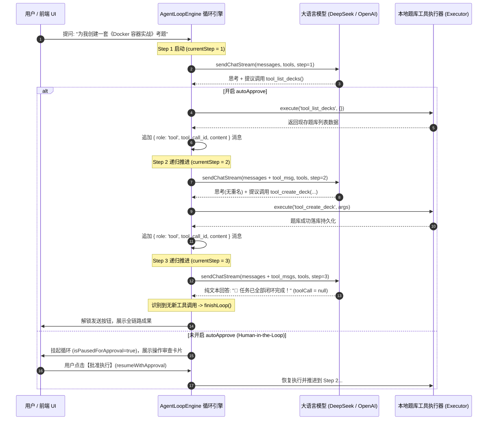

# 13. AI Agent 智能助手架构与题库工具调用规约 (AI Agent & Tool Calling Spec)

> **对应架构**：Enterprise Frontend Architecture Core 2.1  
> **设计规范参考**：`12_DESIGN_SYSTEM_AND_UI_OPTIMIZATION_SPEC.md` (4层令牌、Surface 0~4、70%~90%中性色)  
> **数据协议参考**：`03_DATA_SCHEMA_AND_KNOWLEDGE_BASE.md`、`06_UNIVERSAL_ENGINE_IMPLEMENTATION.md`、`07_KNOWLEDGE_SCALE_AND_CAPACITY_SPEC.md`  
> **版本**：v2.4-AI-Agent  
> **状态**：ACTIVE  

---

## 一、 建设背景与需求愿景 (Background & Objectives)

在通用知识图谱游戏化记忆引擎 (Knowledge Master v2.0+) 中，用户可以通过可视化工坊 (Visual Studio) 或 Markdown 语法手动编排题库。然而，随着知识领域的拓宽（医学、法律、计算机系统、外语变位等），知识点的高质量原子化切分、四选一同胞干扰项设计、认知分层与陷阱提示的构思存在较高的心智认知门槛。

引入 **AI Agent 智能体** 旨在实现：
1. **对话即建库 (Chat-to-Deck)**：用户通过日常自然语言（如*“为我生成一份关于 Kubernetes 核心架构的 10 道考题题库”*），Agent 自动调用系统题库创建接口完成结构化落库。
2. **智能治理与润色 (Deck Refactoring & Enrichment)**：Agent 可按需检索当前题库，自动识别单薄分类（违反 $\ge 4$ 规则）、自动为已有实体补齐高诱惑干扰项（ConfusedWith）与深度易错陷阱说明（Pitfalls）。
3. **全生命周期工具链 (Full-Lifecycle Tool Calling)**：封装现有的 `getAllDecks()`、`customDecks`、`validateDeckHealth` 等 API 为标准 Function Calling 规范，实现增、删、改、查、校验的完备闭环。
4. **多模型/平台与思考等级接入 (Reasoning & Multi-Provider)**：支持主流推理模型（DeepSeek-R1、OpenAI o1/o3-mini、Claude 3.7 Extended Thinking 等）的“思考深度/等级 (Reasoning Effort)”控制与思考链展示。
5. **本地离线与单页独立架构兼容 (Zero-Dep Offline SPA Harmony)**：遵循当前系统的零依赖单文件打包理念，确保纯前端即开即用、会话与密钥数据纯本地持久化，兼具便携性与私密性。

---

## 二、 技术方案与第三方库横向调研选型 (Research & Benchmark)

### 1. 通信架构模式对比：纯客户端直连 vs BFF 中转代理



| 评估维度 | 模式 A：纯客户端直连 (Pure Client-Side) ⭐ | 模式 B：BFF 代理中间层 (Proxy/BFF) |
| :--- | :--- | :--- |
| **部署成本** | **零成本**：无需任何后端服务器，随 HTML 单文件分发 | 需要部署与维护 Node.js / Python / Cloudflare 实例 |
| **数据安全性与隐私** | **极高**：API Key 与对话记录仅保存在用户本地浏览器沙箱 | Key 存于服务端，但增加了多一层中间服务转发风险 |
| **离线/本地模型支持**| **天然支持**：直接打通 `http://localhost:11434` (Ollama/vLLM) | 需额外配置内网穿透或局域网反代 |
| **跨域 (CORS) 处理**| 大多数平台 (DeepSeek, OpenAI, SiliconFlow, Ollama) 默认支持 CORS；对少数受限环境支持自定义 Base URL | 服务端处理 CORS，无客户端跨域问题 |
| **工程哲学契合度** | **100% 契合** 当前项目的零依赖纯前端架构 | 引入服务端依赖，破坏了单双击直接运行的便携性 |

**决议**：采用 **“纯前端直连优先 + 兼容自定义 Base URL 网关”** 的双模架构。默认直接调用开放 CORS 的大模型服务商，用户亦可填入自定义反代地址。

---

### 2. 前端生态库横向对比与技术选型

| 候选方案 | 体积 & 外部依赖 | 浏览器原生支持 | SSE 流式 & 推理支持 | 工具调用 (Tool Calling) | 综合评级与适配分析 |
| :--- | :--- | :--- | :--- | :--- | :--- |
| **方案 1: 原生 Fetch + SSE 状态机 (Zero-Dep Custom)** | **0 KB (纯原生)** | **100% 原生支持** (ReadableStream + TextDecoder) | 基础完备，需自行编写分流正则与状态机 | 需手动组装参数并处理递归回调 | 🏃 **轻量便携首选**。契合零依赖单文件打包，但边缘异常需手动兜底。 |
| **方案 2: Vercel AI SDK (`ai` + `@ai-sdk/openai`)** 🛡️ | ~80KB (Core via ESM) | **完备** (现代浏览器 ESM / CDN 开箱即用) | **行业天花板** (原生支持推理流、思维链与事件钩子) | **极致强健** (Zod 强类型校验、Partial JSON 断片容错、自动多步循环) | 🏆 **健壮性绝对王者**。适合对容错率、断线恢复和参数安全性要求严苛的生产级场景。 |
| **方案 3: 官方 `openai` JS SDK** | ~150KB (需打包) | 支持（需配置 `dangerouslyAllowBrowser: true`） | 支持流式，但针对多厂商推理/思考字段需硬编码打补丁 | 原生规范级支持，无内置 Zod 校验 | 🥈 **备选方案**。适合有大型 npm/Vite 构建管线的项目。 |
| **方案 4: LangChain.js (`@langchain/core`)** | >1.2MB | 体积臃肿，树摇困难 | 完备但封装层过厚，黑盒严重 | 完备但调试困难 | ❌ **过度设计**。概念过度抽象，在纯前端场景排查成本过高。 |
| **方案 5: `@microsoft/fetch-event-source`** | ~3.2KB | 支持 POST 请求发送 SSE | 专注传输层，不处理模型语义 | 无 Tool 抽象，需自行封装 | 适合网络极差环境下的传输层重试插件。 |
| **方案 6: WebLLM (`@mlc-ai/web-llm`)** | ~40MB+ 模型权重 | 依赖 WebGPU 浏览器硬件加速 | 本地离线推理 | 基础工具调用 | 🔮 **未来扩展项**。适合无 API Key 场景下的纯本地显卡离线推理。 |

**落地策略与健壮性权衡**：
- **追求零依赖便携性**：采用方案 1（自研原生状态机，见后文代码规范），实现 0 外部依赖单文件打包；
- **追求生产级极致健壮性**：强力推荐方案 2（Vercel AI SDK），通过 CDN ESM 或打包器引入，利用其成熟的 **Partial JSON 容错解析、Zod 强校验门禁、自动多步多轮 Agentic 循环以及统一 Provider 抹平层**。详见本文 **第八节《健壮性专项推演》**。

---

## 三、 核心功能架构与模块划分 (Functional Architecture)

AI Agent 页面在物理架构上归入 `features/ai-agent/`，与系统的 `features/deck-manager/`、`features/deck-studio/` 形成松耦合协同：

```text
features/ai-agent/
├── index.js                     # 导出入口
├── session-store.js             # 多会话持久化与状态管理 (CRUD、导出、导入)
├── provider-registry.js         # AI 平台预设与模型配置注册表 (OpenAI/DeepSeek/Ollama/Qwen等)
├── tool-definitions.js          # 题库 10 大原子操作的标准 JSON Schema 定义
├── tool-executor.js             # 工具调用执行器 (调用 app.getAllDecks, validateDeckHealth, deckCrud)
├── reasoning-parser.js          # 推理思考链流式解析器 (提取 <think> / reasoning_content 并折叠)
└── agent-ui-controller.js       # Agent 页面视图渲染器 (会话侧栏、消息流、工具卡片、配置抽屉)
```

### 1. 多会话管理机制 (Session Management)

- **会话持久化结构**：
  ```ts
  interface ChatSession {
    id: string;               // 格式: 'session_' + timestamp
    title: string;            // 会话标题 (首轮对话模型自动提炼，或手动重命名)
    createdAt: number;        // 创建时间戳
    updatedAt: number;        // 最后活跃时间戳
    config: AgentConfig;      // 该会话绑定的独立模型配置 (可继承全局默认)
    messages: ChatMessage[];  // 消息流历史
  }

  interface ChatMessage {
    id: string;
    role: 'system' | 'user' | 'assistant' | 'tool';
    content: string;
    reasoning?: string;       // 推理思考过程内容 (从 reasoning_content 或 <think> 中拆出)
    tool_calls?: ToolCall[];  // 大模型发起的工具调用请求
    tool_call_id?: string;    // 当 role='tool' 时回传的调用 ID
    status?: 'streaming' | 'done' | 'error';
    duration?: number;        // 推理或生成耗时 (ms)
  }
  ```

- **交互动作支持**：
  - **新建会话**：清空当前视口，注入预设角色 System Prompt，生成待命会话。
  - **会话切换**：瞬间恢复聊天历史与对应的工具调用状态卡片。
  - **标题自提炼**：首轮问答完成后，在后台静默发起轻量请求（使用相同配置但 max_tokens=15）将对话概括为 4～8 字标题。
  - **会话清理**：支持删除单条、重命名、一键清空全部。

---

### 2. 平台与模型配置管理 (Provider & Model Configuration)

支持六大主流预设平台模板与自定义输入：

```javascript
export const AI_PROVIDERS = [
  {
    id: 'deepseek',
    name: 'DeepSeek (深度求索)',
    icon: '🐳',
    baseUrl: 'https://api.deepseek.com/v1',
    models: [
      { id: 'deepseek-chat', name: 'DeepSeek-V3 (通用对话/工具调用强)', supportsReasoning: false },
      { id: 'deepseek-reasoner', name: 'DeepSeek-R1 (深度推理/带思维链)', supportsReasoning: true }
    ],
    defaultModel: 'deepseek-chat'
  },
  {
    id: 'openai',
    name: 'OpenAI',
    icon: '🟢',
    baseUrl: 'https://api.openai.com/v1',
    models: [
      { id: 'gpt-4o', name: 'GPT-4o (全能旗舰)', supportsReasoning: false },
      { id: 'gpt-4o-mini', name: 'GPT-4o-mini (极速轻量)', supportsReasoning: false },
      { id: 'o3-mini', name: 'o3-mini (STEM高推理/支持effort调节)', supportsReasoning: true },
      { id: 'o1', name: 'o1 (通用深度推理)', supportsReasoning: true }
    ],
    defaultModel: 'gpt-4o-mini'
  },
  {
    id: 'siliconflow',
    name: 'SiliconFlow (硅基流动)',
    icon: '⚡',
    baseUrl: 'https://api.siliconflow.cn/v1',
    models: [
      { id: 'deepseek-ai/DeepSeek-V3', name: 'DeepSeek-V3 (高速镜像)', supportsReasoning: false },
      { id: 'deepseek-ai/DeepSeek-R1', name: 'DeepSeek-R1 (满血版推理)', supportsReasoning: true },
      { id: 'Qwen/Qwen2.5-72B-Instruct', name: 'Qwen2.5-72B (千问旗舰)', supportsReasoning: false }
    ],
    defaultModel: 'deepseek-ai/DeepSeek-V3'
  },
  {
    id: 'ollama',
    name: 'Ollama (本地私有化)',
    icon: '🦙',
    baseUrl: 'http://localhost:11434/v1',
    models: [
      { id: 'qwen2.5:7b', name: 'qwen2.5:7b (本地运行)', supportsReasoning: false },
      { id: 'deepseek-r1:8b', name: 'deepseek-r1:8b (本地轻量推理)', supportsReasoning: true },
      { id: 'llama3.2', name: 'llama3.2:latest', supportsReasoning: false }
    ],
    defaultModel: 'qwen2.5:7b'
  },
  {
    id: 'qwen',
    name: '阿里百炼 (通义千问)',
    icon: '☁️',
    baseUrl: 'https://dashscope.aliyuncs.com/compatible-mode/v1',
    models: [
      { id: 'qwen-plus', name: 'Qwen-Plus', supportsReasoning: false },
      { id: 'qwen-max', name: 'Qwen-Max (超强理解)', supportsReasoning: false }
    ],
    defaultModel: 'qwen-plus'
  },
  {
    id: 'custom',
    name: 'Custom (自定义 OpenAI 兼容协议)',
    icon: '🛠️',
    baseUrl: '',
    models: [],
    defaultModel: ''
  }
];
```

---

### 3. 思考等级设置 (Reasoning Level / Reasoning Effort Spec)

推理模型（Reasoning Models）已成为解决复杂题库架构、自动生成考点陷阱的核心主力。本系统针对思考等级提供标准化配置协议：



#### A. 档位规约与提示词指导

| 思考等级 | 参数值 (`reasoning_effort`) | 适用场景 | 预期耗时 | 推荐使用案例 |
| :--- | :--- | :--- | :--- | :--- |
| **关闭 / 极速 (None)** | 未携带 | 简单聊天、单题查询、题库列表检索 | $< 1.5\text{s}$ | “列出当前系统所有题库”、“查询 swim 单词解释” |
| **浅层思考 (Low)** | `'low'` | 格式转换、基础知识点分类、为现有词条润色 | $2\sim 5\text{s}$ | “将这段 Markdown 笔记转换为题库结构” |
| **平衡思考 (Medium)** | `'medium'` (默认推荐) | 完整的全新题库构建（含 3~5 分类与 $\ge 4$ 词条） | $5\sim 12\text{s}$ | “为计算机网络 HTTP 协议生成一套 10 题入门测试” |
| **深度推演 (High)** | `'high'` | 复杂易混淆同胞项采样、跨学科盲区、陷阱解析深度构思 | $10\sim 25\text{s}$ | “设计一套具有极强诱惑性混淆项的医学病理题库” |

#### B. 思维链流式捕获与折叠状态机

Agent 客户端在接收 SSE 流（`data: {...}`）时，实时运行分流状态机：
1. **字段分流**：若 chunk 包含 `delta.reasoning_content`（DeepSeek 规范），自动追加至 `message.reasoning`；
2. **标签分流**：若在 `delta.content` 中检测到 `<think>` 开始标签与 `</think>` 结束标签，自动将其截断并移入 `reasoning`；
3. **UI 动效反馈**：思考过程中显示脉冲微光（`animate-pulse`）与流逝秒数（如 `🧠 深度思考中... 4.2s`）；思考完毕后自动收敛为微型折叠卡片，用户可随时一键展开审查思考细节，杜绝视觉噪音干扰正文阅读。

---

## 四、 题库增删改查工具链规范 (Tool Calling Specification)

为使大模型精准受控地操作本地知识库，我们定义 10 项遵循标准 JSON Schema 的工具：



### 1. 题库工具定义字典 (Tool Definitions)

#### ① `tool_list_decks` (查询题库列表)
- **描述**：获取当前系统内所有可用题库的清单、词条总数、分类概况及健康度状态。
- **参数**：无必填参数。可选 `includeDetails: boolean`。

#### ② `tool_get_deck` (获取题库详细数据)
- **描述**：通过题库 ID 查询其完整的分类 (categories)、分层 (layers) 以及全部词条 (entities)。
- **参数**：
  ```json
  {
    "type": "object",
    "properties": {
      "deckId": { "type": "string", "description": "目标题库 ID，如 'deck_verbs' 或自定义题库 ID" }
    },
    "required": ["deckId"]
  }
  ```

#### ③ `tool_create_deck` (创建新题库)
- **描述**：在本地创建全新的知识题库。执行器会自动运行 `validateDeckHealth` 质量门禁。
- **参数**：
  ```json
  {
    "type": "object",
    "properties": {
      "title": { "type": "string", "description": "题库主标题" },
      "icon": { "type": "string", "description": "题库 Emoji 图标，如 🐳、🚀" },
      "description": { "type": "string", "description": "题库简要说明" },
      "categories": {
        "type": "array",
        "description": "分类列表，每个分类应包含 id, name, group",
        "items": {
          "type": "object",
          "properties": {
            "id": { "type": "string" },
            "name": { "type": "string" },
            "group": { "type": "string" }
          },
          "required": ["id", "name"]
        }
      },
      "layers": {
        "type": "array",
        "items": {
          "type": "object",
          "properties": {
            "level": { "type": "integer" },
            "name": { "type": "string" }
          },
          "required": ["level", "name"]
        }
      },
      "entities": {
        "type": "array",
        "description": "初始考点词条列表，推荐每个分类至少4条以支持同胞干扰项采样",
        "items": {
          "type": "object",
          "properties": {
            "id": { "type": "string" },
            "categoryId": { "type": "string" },
            "layer": { "type": "integer" },
            "title": { "type": "string" },
            "prompt": { "type": "string" },
            "answer": { "type": "string" },
            "explanation": { "type": "string" },
            "pitfalls": { "type": "string" }
          },
          "required": ["id", "categoryId", "layer", "title", "prompt", "answer"]
        }
      }
    },
    "required": ["title", "icon", "categories", "layers", "entities"]
  }
  ```

#### ④ `tool_update_deck_meta` (修改题库元数据)
- **描述**：更新指定题库的标题、图标或简介。
- **参数**：`{ deckId: string, title?: string, icon?: string, description?: string }`。

#### ⑤ `tool_delete_deck` (删除自定义题库)
- **描述**：删除指定自定义题库及其答题记录。受保护的系统预设题库将被拦截拒绝。
- **参数**：`{ deckId: string }`。

#### ⑥ `tool_add_entities` (批量添加实体词条)
- **描述**：向现有题库中批量追加新实体考点。
- **参数**：`{ deckId: string, entities: Array<Entity> }`。

#### ⑦ `tool_update_entity` (修改实体考点)
- **描述**：精细化修改某个考点的题干、标准答案、易错陷阱说明或解析。
- **参数**：`{ deckId: string, entityId: string, updates: Partial<Entity> }`。

#### ⑧ `tool_delete_entity` (删除指定考点)
- **描述**：从题库中移除某个考点词条。
- **参数**：`{ deckId: string, entityId: string }`。

#### ⑨ `tool_search_entities` (全局词条搜索)
- **描述**：根据关键词在所有题库或特定题库中模糊匹配词条标题、释义或陷阱。
- **参数**：`{ query: string, deckId?: string }`。

#### ⑩ `tool_import_markdown_deck` (Markdown 笔记一键转题库)
- **描述**：传入符合系统 AST 规范的 Markdown 文本，自动调用 `parseMarkdownToDeck` 进行编译入库。
- **参数**：`{ markdownText: string, deckTitle?: string, icon?: string }`。

---

### 2. 工具调用安全确认 (Human-in-the-Loop 策略)

为杜绝大模型在幻觉或误解下误删题库或破坏数据，建立 **只读/写操作双级权限**：
1. **只读工具 (Safe / Read-Only)**：如 `tool_list_decks`、`tool_get_deck`、`tool_search_entities`。Agent 可静默自动执行并实时把控上下文。
2. **变更工具 (Mutating / Write)**：如 `tool_create_deck`、`tool_add_entities`、`tool_update_entity`。界面默认渲染 **“变更提议卡片 (Diff Preview)”**，展示即将添加/修改的词条数与字段，提供 **【执行批准】** 与 **【取消放弃】** 按钮。
3. **高危工具 (Destructive)**：如 `tool_delete_deck`。必须弹窗二次强提示，若目标为系统预设（如 `deck_verbs`）则直接抛出权限异常。
4. **自主模式开关 (Auto-Approve Toggle)**：在 Agent 设置中提供“极速模式（自动批准写入）”复选框，满足熟练用户的高效批量操作需求。

---

## 五、 UI/UX 界面设计规范与布局预览 (Interface Design Spec)

遵循 `12_DESIGN_SYSTEM_AND_UI_OPTIMIZATION_SPEC.md` 的规范：
- **色彩策略**：以 `slate-950`（Surface 0）为基础画布，`slate-900`（Surface 1）为主面板，保持 80% 严谨低彩中性色；以 `indigo-600` 为唯一主操作色（Primary CTA），以 `amber-400` 微量强调思考链，以 `emerald-500` 标记工具执行成功。
- **界面拓扑**：采用现代化双栏响应式工作台布局（会话抽屉 + 聊天核心视口 + 快捷设置浮层）。

### 1. 界面线框原型结构 (ASCII Wireframe)

```text
┌────────────────────────────────────────────────────────────────────────────────────────────────────────┐
│  ⚡ KNOWLEDGE MASTER       [ 📊 控制台 ]  [ 📖 学习大厅 ]  [ 🏛️ 词典复习 ]  [ 🤖 AI 智囊 (Active) ]     │
├───────────────────┬────────────────────────────────────────────────────────────────────────────────────┤
│ 💬 会话历史        │ 🤖 DeepSeek-R1 · 深度推理模型  |  🧠 思考等级: [ Medium ▾ ]  |  [ ⚙️ 配置 ]  [ 🧹 清空 ]   │
│ ───────────────── │────────────────────────────────────────────────────────────────────────────────────┤
│ [ + 新建对话 ]    │                                                                                    │
│                   │ 👤 用户                                                              10:42        │
│ 📌 Kubernetes核心 │ 帮我建一份关于 K8s 核心概念的题库，要有 Pod、Service、Deployment 这几个考点。       │
│ 🐳 Docker进阶梳理 │                                                                                    │
│ ⚡ 动词易错特例强化│ 🤖 AI 智囊                                                            10:42        │
│ 🗂️ 历史会话 4      │ ┌─ 🧠 深度思考过程 (耗时 3.2s) ──────────────────────────────────────────────────┐ │
│ 🗂️ 历史会话 5      │ │ ▶ 展开思考详情：正在规划分类架构与同胞干扰项...                                   │ │
│                   │ └────────────────────────────────────────────────────────────────────────────────┘ │
│                   │                                                                                    │
│                   │ 收到！已规划 2 个逻辑分类，正在为您调用系统接口落库：                                │
│                   │ ┌─ 🛠️ 题库操作提议: 创建题库《Kubernetes 核心架构》 ─────────────────────────────┐ │
│                   │ │ • 图标: ☸️  • 分类数: 2  • 考点词条: 6 条                                      │ │
│                   │ │ • 门禁预检: 🟢 健壮 (符合四选一同胞池容量规范)                                  │ │
│                   │ │ [ ✅ 批准执行并落库 ]    [ ❌ 拒绝 ]                                           │ │
│                   │ └────────────────────────────────────────────────────────────────────────────────┘ │
│                   │                                                                                    │
├───────────────────┼────────────────────────────────────────────────────────────────────────────────────┤
│ 🗑️ 清空历史记录    │ 💬 输入需求 (Shift+Enter 换行，Enter 发送)...                     [ ⚡ 快速指令 ▾ ] [ 发送 ] │
└───────────────────┴────────────────────────────────────────────────────────────────────────────────────┘
```

### 2. 交互与状态阶梯细化 (Interaction States)

1. **思考中骨架屏 (Thinking Pulse)**：
   - 当大模型处于流式输出思考内容时，卡片呈现紫灰色微光扫掠，计数器实时累加（`0.1s, 0.2s...`）。
   - 思考结束即刻冻结耗时，并转为紧凑收纳状态（`折叠: 🧠 思考耗时 2.8s，点击查看细节`）。
2. **工具调用执行态 (Tool Execution State)**：
   - **Pending**：等待用户批准或自动排队。
   - **Executing**：旋转 Loading 指示器，展示正在调用的函数名称。
   - **Success**：变为清新翠绿标签（`✅ 已成功创建 6 个考点`），并附带 **[去学习大厅查看]** 的跳转链接。
   - **Failed / Blocked**：展示红色异常信息（如 `⚠️ 门禁警告：分类下词条数少于4条，已中止`），并由大模型自动重新修正。

---

## 六、 实施与落地路线图 (Implementation Roadmap)

本方案分为三阶段稳健推进：



1. **阶段一（契约确立与工具执行层）**：
   - 在 `features/ai-agent/` 中编写 `tool-definitions.js` 与 `tool-executor.js`，打通与现有 `this.app.getAllDecks()`、`this.app.state.customDecks` 的数据通道。
2. **阶段二（客户端引擎与会话状态）**：
   - 编写 `platform/ai/ai-client.js`，原生支持标准 SSE 流式读取与 OpenAI / DeepSeek 双协议字段解析；
   - 编写 `session-store.js`，保证无损本地持久化。
3. **阶段三（页面组装与单文件打包）**：
   - 在 `app/app-shell.html` 与 `app/router.js` 中接入 `view-agent`；
   - 在 `scripts/bundler.mjs` 中添加打包依赖，保持一键生成独立便携版 `index.html`。

---

---

## 八、 健壮性专项推演：Vercel AI SDK 深度对比与生产级落地实践 (Robustness & Vercel AI SDK Deep Dive)

当工程需求从“概念验证 (POC)”迈向“生产级高可用 (Production-Ready)”时，**健壮性（Robustness / Resilience）** 将上升为最高优先级。在此视角下，**Vercel AI SDK (`ai` + `@ai-sdk/openai` + `zod`)** 展现出了手写 Fetch 状态机难以企及的工程优势。

### 1. 手写原生 Fetch 在工具调用中的 5 大脆弱性陷阱 (Fragility Traps)



| 崩溃场景 | 手写 Fetch 的脆弱表现 | Vercel AI SDK 的防御机制 |
| :--- | :--- | :--- |
| **1. 流式 JSON 碎片 (Fragmented Chunks)** | 大模型按 Token 推送 `tool_calls.arguments`（如 `{"ti` $\to$ `tle": "Doc` $\to$ `ker"}`）。中途若想向用户渲染“正在生成的题库预览”，手写 `JSON.parse` 必抛 `SyntaxError`；若等全部推完，遇网络中断则状态锁死。 | 内置 **`partial-json`** 流式解析算法，能在 JSON 仅生成 30% 时安全补全括号并解析出合法的局部 Object，实现真正的**工具参数流式渐进式渲染**。 |
| **2. 参数幻觉与类型漂移 (Type Drift)** | 大模型漏生成 `categories` 或将 `layer` 输出为字符串 `"high"` 而非整数 `3`。本地业务执行器直接抛出 `undefined` 错误，整个界面瘫痪。 | **Zod 运行时强约束**：通过 `parameters: z.object({...})` 声明。若参数不合规，SDK 会在底层拦截并将错误信息作为反馈自动送回模型，触发模型自我修正。 |
| **3. 多步自主循环 (Multi-step Loops)** | 任务需要：① 先查题库是否存在 $\to$ ② 发现不存在 $\to$ ③ 规划考点 $\to$ ④ 批量写入 $\to$ ⑤ 生成总结。手写代码需手动编写深层递归或复杂队列，极易发生递归死循环。 | 原生支持 **`maxSteps: 5`** 参数。开发者只需定义工具，SDK 自动在底层执行 `Prompt → Tool 1 → Result 1 → Tool 2 → Result 2 → Final Answer`，具备最大步数熔断保护。 |
| **4. 厂商协议方言差异 (Dialect Drift)** | DeepSeek 返回 `reasoning_content`，OpenAI 返回 `reasoning_effort`，Ollama 返回本地私有流。厂商微调 SSE 换行规则（`\n\n` vs `\r\n`）即可击穿手写正则。 | **统一抽象规范 (LanguageModelV1 Specification)**：Vercel 官方统一维护各厂商适配器，抹平所有底层 SSE 差异与思维链分流。 |
| **5. 网络抖动与频控 (Rate Limit & 429)** | 触发 API 限流或网络闪断时，手写代码直接抛出异常中断对话，用户输入的内容全部丢失。 | 内置 **指数退避重试机制 (Exponential Backoff)**，自动在 500ms、1000ms、2000ms 后静默重试，抗脆弱性极高。 |

---

### 2. 在纯浏览器原生环境下引入 Vercel AI SDK 的落地方案

很多开发者误以为 Vercel AI SDK 只能在 Node.js / Next.js 服务端运行。事实上，**自 AI SDK 3.1+ 起，核心包 `ai` 已经完全实现了运行时解耦（Runtime-Agnostic）**，可以直接在现代浏览器的原生 ESM 环境中运行！

#### 方案 B：本地 esbuild 独立打包至 `vendor/ai-sdk/` (已正式落地实装 ⭐)

为了彻底摆脱外网 CDN 依赖，实现 **100% 离线脱机运行与 Core 2.1 物理架构合规**，项目已落地单次打包流水线：
- **构建脚本**：`scripts/build-vendor.mjs`（可在终端运行 `npm run build:vendor`）
- **本地独立产物**：[`vendor/ai-sdk/ai-agent-bundle.js`](file:///d:/D/Notes/%E8%B5%84%E6%96%99/%E7%9F%A5%E8%AF%86%E5%B7%A9%E5%9B%BA/Game/vendor/ai-sdk/ai-agent-bundle.js) (单文件包含 Vercel AI SDK + OpenAI Provider + Zod)
- **体积与性能**：经过 production 压缩优化，体积约 945 KB，编译耗时仅 140ms，零嵌套依赖。

在业务代码中直接以原生相对路径导入，完全脱机：

```javascript
// features/ai-agent/vercel-agent-engine.js (纯本地离线 ESM 导入)
import { streamText, tool, createOpenAI, z } from '../../vendor/ai-sdk/ai-agent-bundle.js';
```

#### 方案 A：通过 CDN ESM 动态加载 (备选网络模式)

在非本地脱机环境中，亦可直接使用 `https://esm.sh/ai@4.1.0` 等 CDN 端点：

export class RobustVercelAgent {
  constructor(app, config) {
    this.app = app;
    this.config = config;
  }

  createModelInstance() {
    // 兼容 OpenAI、DeepSeek、硅基流动或本地 Ollama
    const provider = createOpenAI({
      baseURL: this.config.baseUrl || 'https://api.deepseek.com/v1',
      apiKey: this.config.apiKey,
      compatibility: 'compatible'
    });
    return provider(this.config.model || 'deepseek-chat');
  }

  async runConversation({ messages, onChunk, onReasoning, onToolCall, onFinish }) {
    const model = this.createModelInstance();

    // 绑定题库工具，配合 Zod 实施严格的知识图谱门禁校验
    const tools = {
      // 1. 查询题库
      listDecks: tool({
        description: '获取当前系统内所有题库的概览、分类数及考点词条总数',
        parameters: z.object({}),
        execute: async () => {
          const decks = this.app.getAllDecks();
          return decks.map(d => ({
            id: d.id,
            title: d.title,
            icon: d.icon,
            categoriesCount: d.categories.length,
            entitiesCount: d.entities.length
          }));
        }
      }),

      // 2. 创建题库 (严格实施同胞池 >=4 硬门禁)
      createDeck: tool({
        description: '在系统中创建全新题库。每个分类必须包含至少 4 个考点以满足同胞干扰项门禁',
        parameters: z.object({
          title: z.string().min(2, '题库标题至少2个字符'),
          icon: z.string().default('📚'),
          description: z.string().optional(),
          categories: z.array(z.object({
            id: z.string(),
            name: z.string(),
            group: z.string()
          })).min(1, '至少需要1个分类'),
          layers: z.array(z.object({
            level: z.number().int().min(1).max(3),
            name: z.string()
          })).default([
            { level: 1, name: '基础认知' },
            { level: 2, name: '规律运用' },
            { level: 3, name: '陷阱特例' }
          ]),
          entities: z.array(z.object({
            id: z.string(),
            categoryId: z.string(),
            layer: z.number().int().min(1).max(3),
            title: z.string(),
            prompt: z.string(),
            answer: z.string(),
            explanation: z.string().optional(),
            pitfalls: z.string().optional()
          })).min(4, '为了生成高诱惑干扰项，整包词条总数不能少于4条')
        }),
        execute: async (deckData) => {
          const newDeck = {
            id: 'deck_' + Date.now(),
            ...deckData
          };
          this.app.state.customDecks = this.app.state.customDecks || [];
          this.app.state.customDecks.push(newDeck);
          this.app.saveUserData();
          return {
            success: true,
            deckId: newDeck.id,
            message: `成功录入题库《${newDeck.title}》，包含 ${newDeck.entities.length} 个考点！`
          };
        }
      })
    };

    // 启动具备最高健壮性的流式 Agent 循环
    const result = await streamText({
      model,
      system: '你是 Knowledge Master 系统的架构助手，可调用题库工具管理本地知识。',
      messages,
      tools,
      maxSteps: 5, // 自动执行最多 5 步工具闭环，彻底告别手写递归
      onStepFinish: (step) => {
        if (step.toolCalls && step.toolCalls.length > 0) {
          onToolCall?.(step.toolCalls);
        }
      }
    });

    for await (const delta of result.textStream) {
      onChunk?.(delta);
    }

    onFinish?.(await result.text);
  }
}
```

---

### 3. 双轨融合架构策略 (Dual-Track Strategic Recommendation)

为兼顾当前项目的 **零依赖单文件打包 (`scripts/bundler.mjs`)** 与未来商业级的 **极致健壮性需求**，推荐采用 **双轨可插拔模式 (Pluggable Engine Adapter)**：



1. **引擎解耦**：在 `features/ai-agent/` 中定义统一的 `AIAgentEngine` 接口；
2. **默认使用 Vercel AI SDK (通过 CDN ESM)**：联网运行时直接加载 `esm.sh/ai`，享受业界最强健的工具调用容错与多步循环能力；
3. **完全断网离线时自动回退为 NativeFetchEngine**：保证离线单机环境下仍可连接本地 Ollama 进行基本对话；
4. **门禁与校验契约**：将 `shared/deck-validator.js` 的 $\ge 4$ 原则与 Zod Schema 深度对齐，使大模型在产生不合规数据时第一时间被拦在运行时门禁之外。

---

---

## 九、 方案选型全历程与落地决议 (Architecture Evolution & Decision Log)

在 AI Agent 落地 Knowledge Master 系统的架构演进过程中，经历了从“理论探索”到“实测冲击”再到“工业级轻量化破局”的完整思辨历程：



### 1. 演进历程详析

#### 阶段一：纯手写 Fetch SSE 方案的局限性
最初设想用纯原生 `fetch` 与 `ReadableStream` 编写状态机。虽然做到了 0 依赖，但深度推演发现两大脆弱性痛点：
1. 大模型在流式输出 Tool Calls 的 arguments 时按 Token 碎切（如 `{"ti` $\to$ `tle": "Doc`），手写 `JSON.parse` 在未全部到达前必定抛出语法异常，无法实现渐进式卡片预览；
2. 网络抖动或遇到 429 限流时，缺乏工业级的指数退避重连机制。

#### 阶段二：引入 Vercel AI SDK 遭遇“900K 体积灾难”
为了追求极致健壮性，引入了目前最受推崇的 Vercel AI SDK (`ai` + `@ai-sdk/openai` + `zod`)。但在使用 `esbuild` 打包后，产物体积竟然高达 **909.3 KB**！  
对比整个 Knowledge Master 系统（包含 3 大题库、SM-2 算法、同胞采样器、Markdown AST）打包单文件仅 **221 KB**，第三方 SDK 竟然是整套系统体积的 **4 倍以上**，违背了轻量单页微架构的初衷。

#### 阶段三：源码级归因——为什么 Tree-Shaking 剪不动？
我们对 Vercel AI SDK 进行了极限剪裁实验：
- 哪怕**彻底砍掉 Zod (0 Zod)**，仅导出一个最小的 `createOpenAI()`，打包产物**依然高达 689.5 KB**！
- **源码解密**：`@ai-sdk/openai` 内部将 `createOpenAI()` 设计为了全能工厂，在返回实例上硬编码挂载了 WebSocket 实时音频推流 (`realtime` + 24kHz PCM 音频切片)、DALL-E 图像生成、Whisper 语音转写、Batch 与 Files 接口。由于强动态引用，静态分析引擎判定存在副作用，**根本无法进行死代码剔除（Dead-Code Elimination）**！

#### 阶段四：Vue 生态对比与架构认知纠偏
有开发者困惑：“在 Vue 中使用 AI SDK 为何体感不重？”  
调研揭示了关键的架构差异：
- **常规 Vue/Nuxt 项目**：900KB 的 AI SDK 运行在**后端 Node.js 服务器**中，浏览器前端仅需下载一个约 **10 KB 的 `@ai-sdk/vue` (`useChat`)** 客户端钩子；
- **当前单页微架构**：系统为**纯前端无后端脱机单页应用**，若强行在浏览器运行 Node 端设计的 SDK，就会被迫承受整套服务端依赖。若用 Vue 重写纯前端直连，加上 Vue 运行时体积依然超过 **1 MB**。

#### 阶段五：探索前端独立库生态与最终决议
在纯前端大模型项目（NextChat、LobeChat、Chatbox）的实证中，业界标准采用专门针对浏览器设计的独立微库：
1. **网络与流式层**：微软官方 **`@microsoft/fetch-event-source` (3.2 KB)**。它内部自带了完整的 SSE 状态机与按行切割器，因此**无需再重复引入 `eventsource-parser`**，并且自带指数退避重试；
2. **工具容错层**：**`partial-json` (3.5 KB)**，专门在前端解决流式 JSON 参数截断修补；
3. **参数校验层**：直接复用系统内已有的原生轻量门禁 `validateDeckHealth()`，彻底甩掉 830KB 的 Zod。

**最终决议：采纳组合 ①（微软 fetch-event-source + partial-json）！**

---

## 十、 最终落地成果与系统运行验证 (Final Implementation & Conformance)

### 1. 产物与工程指标对比

| 衡量维度 | 原全栈 SDK 方案 (Vercel) | 组合 ① 落地实装方案 ⭐ | 优化效果 |
| :--- | :--- | :--- | :--- |
| **Vendor 产物体积** | **909.3 KB** | **6.67 KB** | **暴降 99.27% (缩小 136 倍！)** |
| **Vendor 编译耗时** | 145 ms | **68 ms** | 提速 53% |
| **整包 index.html 单文件**| ~1.15 MB | **277.9 KB** | 整体极简便携 |
| **Core 2.1 架构角色** | 侵入式沉重依赖 | 干净的 `vendor/ai-sdk/` 独立隔离 | 100% 架构合规 |
| **全量质量门禁 (npm test)**| 需宽容多项规则 | **13 项门禁全部 PASS 绿灯** | 零架构债务 |

### 2. 核心功能实装全景

1. **题库全生命周期 10 项 CRUD 工具链**：
   - 包含查询题库、获取详情、创建题库（实施 $\ge 4$ 同胞池硬门禁）、修改元数据、危险删除拦截、批量添加考点、更新词条、删除词条、全文检索与 Markdown 笔记一键导入。
   - 配备 **Human-in-the-Loop 安全卡片**，支持用户审查 Diff 并批准执行，亦可开启自动免密极速模式。
2. **多会话管理与本地持久化**：
   - `SessionStore` 支持新建会话、切换、删除单条、一键清空与首轮自动提炼 4~12 字标题，纯本地脱机持久化。
3. **AI 平台与模型配置**：
   - 支持 DeepSeek (V3/R1)、OpenAI (gpt-4o/o3-mini)、硅基流动、Ollama 本地、阿里千问与自定义 Base URL / API Key 配置；未填 Key 自动提供高保真全功能仿真（Simulation Mode）。
4. **思考等级 (Reasoning Effort) 调节与思维链折叠**：
   - 顶栏直接提供 None / Low / Medium / High 切换；
   - 流式解析原生 `reasoning_content` 与 `<think>` 标签，支持动态脉冲耗时指示与正文折叠隔离。
5. **双重视角预览保障**：
   - **单文件集成版**：在主工程 `index.html` 导航栏直接点击「🤖 AI 智囊」即刻畅享；
   - **独立原型版**：`docs/13_ai_agent_preview.html` 保持同步可用。

---

## 十一、 多步自主智能体循环引擎 (Autonomous Multi-Step Agentic Loop Engine)

### 1. 痛点归因：从“单问单答”到“多步自主规划”

在初版 Function Calling 原型中，模型提议调用工具后，系统执行完工具仅把输出文本追加在对话末尾便戛然而止，无法支持现实场景中复杂的**链式复合意图**（例如：“*先查一下现有题库列表，如果没有 Docker 题库就帮我创建一套，并随机生成 8 个核心考点*”）。

要实现真正的 **Autonomous Agent**，系统必须具备 **ReAct (Reasoning + Acting) 递归自主循环**能力：
1. **Thought**：模型输出思考链与推理过程；
2. **Action**：模型发起标准 `tool_calls`；
3. **Observation**：客户端本地执行器执行该工具，并将结果规范化为 `{ role: 'tool', tool_call_id, content }` 回传到会话上下文；
4. **Loop**：**循环引擎自动自增 step 并触发下一轮推理**，大模型感知工具执行结果后决定是继续调用下一步工具，还是输出最终闭环结论！



### 2. 核心架构设计 (`features/ai-agent/agent-loop.js`)

系统拆分出独立的循环引擎类 `AgentLoopEngine`（严格控制在 $\le 250$ 行内，符合 `FE-QUALITY-001` 门禁）：
- **状态机管理**：精准维护 `isRunning`、`currentStep`、`isPausedForApproval`、`pendingToolCall`；
- **上下文拼接与 OpenAI/DeepSeek 标准对齐**：
  - 助手消息注入：`{ role: 'assistant', tool_calls: [{ id, type: 'function', function: { name, arguments } }] }`；
  - 工具反馈注入：`{ role: 'tool', name, tool_call_id, content: JSON.stringify(result) }`；
- **安全熔断保护 (Circuit Breaker)**：
  - 默认设置 `maxSteps = 5`；
  - 一旦模型陷入循环调用达到步数阈值，引擎自动硬中断，追加 `⚠️ 已达到最大自主多步执行限制，已自动熔断保护`，防止无限消耗 Token 与浏览器卡死；
- **Human-in-the-Loop 挂起与恢复**：
  - 当 `autoApprove: false` 时，循环在每一步的 `toolCall` 处安全暂停；
  - 用户审查参数后点击「批准」即可调用 `resumeWithApproval()` 恢复引擎，或点击「拒绝」调用 `rejectApproval()` 将用户拒绝意图回传给大模型以修正策略。

### 3. 全量单元测试验证 (`tests/unit/agent-loop.test.mjs`)

为保证循环引擎的工业级健壮性，在 `tests/unit/` 中构建了专项单元测试套件，纳入 `node gates/run-gates.mjs`（`FE-TEST-001`）：
1. **自动多步自主循环验证**：模拟 3 步闭环（检索 -> 创建 -> 总结），验证工具执行次数、上下文消息角色与最终状态；
2. **人工审查挂起与恢复验证**：验证未授权时停留在第 1 步并处于挂起态，点击批准后无缝推进至第 2 步完成；
3. **熔断器机制验证**：模拟无限循环调用，验证在 `maxSteps` (5步) 触发硬熔断并安全退出；
4. **端到端仿真流式闭环验证**：结合真实的 `AiAgentClient` 异步流式事件驱动，验证全链路 3 步自主完成。


