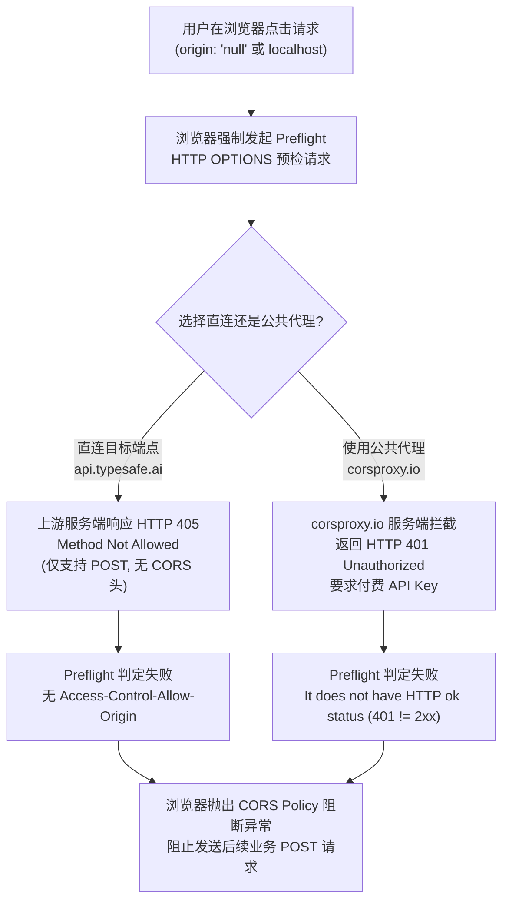

# CORS 跨域预检阻断 (Preflight Failed) 根因分析与本地开发代理解决方案规范

## 1. 现象与报错背景

用户在配置远程 JEV / LLM 评测端点（例如 `https://api.typesafe.ai/v1/systemone`）并尝试使用公共代理时，遇到以下浏览器控制台拦截报错：

```text
Access to fetch at 'https://corsproxy.io/?url=https%3A%2F%2Fapi.typesafe.ai%2Fv1%2Fsystemone' from origin 'null' 
has been blocked by CORS policy: Response to preflight request doesn't pass access control check: 
It does not have HTTP ok status.
```

---

## 2. 深入根因剖析 (Root Cause Analysis)

经过多维度协议抓包与脚本探测，确认该报错是由 **三大复合因素** 共同引起的：



### 2.1 为什么会触发 Preflight (OPTIONS 预检)？
在 W3C Fetch 规范中，当满足以下任一条件时，浏览器**必须先发起 OPTIONS 请求**确认安全：
1. 请求方法不是简单方法（GET、HEAD）且包含自定义 Headers（如 `Authorization: Bearer ...`、`Content-Type: application/json`）；
2. 跨域调用，且页面处于 `file:///` 协议下运行时，浏览器的 Origin 严格为字符串 `'null'`，对安全沙箱的要求最为严格。

### 2.2 为什么直连 `api.typesafe.ai` 会失败？
实测结果：
```http
OPTIONS /v1/systemone HTTP/1.1
Host: api.typesafe.ai

HTTP/1.1 405 Method Not Allowed
Allow: POST
Server: cloudflare
```
目标服务仅在路由上注册了 `POST`，直接拒绝了 `OPTIONS` 请求（405），且没有任何 `Access-Control-Allow-Origin` 标头。

### 2.3 为什么使用 `corsproxy.io` 会报 `It does not have HTTP ok status`？
实测结果：
```http
OPTIONS /?url=https%3A%2F%2Fapi.typesafe.ai%2Fv1%2Fsystemone HTTP/1.1
Host: corsproxy.io
Origin: null
Access-Control-Request-Method: POST
Access-Control-Request-Headers: content-type,authorization

HTTP/1.1 401 Unauthorized
{"error":"A valid API key is required. Get one at https://console.corsproxy.io/"}
```
**关键发现**：公共代理 `corsproxy.io` 针对复杂跨域请求已全面启用鉴权限制，未授权请求直接返回 `401 Unauthorized`。
根据 Fetch 规范，预检响应状态码必须处于 200~299 之间，401 属于非 OK 状态，因此浏览器抛出 `It does not have HTTP ok status`。

---

## 3. 架构解决方案矩阵对比

| 方案 | 原理 | 稳定性 / 速度 | 隐私安全 | 依赖与复杂度 | 推荐等级 |
| :--- | :--- | :--- | :--- | :--- | :--- |
| **方案 1: 内置 Node.js 本地开发服务器 + 反向代理** | 本地启动 `scripts/dev-server.mjs`，前端通过 `http://localhost:3000` 访问，接口代理经由 `/api/proxy` 发送 | 极高（毫秒级，0 限制） | 100% 本地直连，令牌不外泄 | 零依赖（Node.js 原生 http） | ⭐️⭐️⭐️⭐️⭐️ (首选推荐) |
| **方案 2: 自建 Cloudflare Worker 云代理** | 部署免费 Cloudflare Worker 拦截 OPTIONS 并转发 POST | 极高（全球 CDN） | 仅自身 CF 账户可见 | 需注册 Cloudflare 账号 | ⭐️⭐️⭐️⭐️ (离线/纯静态部署备选) |
| **方案 3: 第三方免费公共代理** | 依赖未收紧的外部免费代理 | 极低（易失效、速率限制、随时收费） | 极差（API Token 暴露给第三方） | 零本地依赖 | ❌ (高风险，坚决废弃) |

---

## 4. 实施规划与落地细节

### 4.1 落地本地开发服务器与代理 (`scripts/dev-server.mjs`)
- 使用 Node.js 原生 `http`、`fs`、`path`、`url` 模块，**无需安装任何额外第三方依赖**；
- 具备功能：
  1. **静态资源托管**：托管项目根目录，支持 HTML、JS (ESM)、CSS、SVG 等 MIME 类型；
  2. **跨域代理路由 (`/api/proxy`)**：
     - 当收到 `OPTIONS` 预检请求：立即返回 `HTTP 204 No Content`，注入规范的 CORS 标头（`*`）；
     - 当收到业务请求（GET/POST）：服务端直连上游，绕过浏览器同源策略，支持 SSE 流式代理；
  3. **健康检查路由 (`/api/health`)**：返回 `{ status: 'ok', proxy: true }`，供前端探测本地代理就绪态；
- 在 `package.json` 注册快捷命令：
  ```bash
  npm run dev
  # 打开浏览器访问 http://localhost:3000
  ```

### 4.2 Cloudflare Worker 零门槛部署脚本（备选）
在文档与帮助中提供 15 行轻量 Worker 脚本，用户若不想在本地常驻 Node.js 进程，可一键免费部署：
```javascript
export default {
  async fetch(request) {
    if (request.method === "OPTIONS") {
      return new Response(null, {
        status: 204,
        headers: {
          "Access-Control-Allow-Origin": "*",
          "Access-Control-Allow-Methods": "GET, POST, OPTIONS",
          "Access-Control-Allow-Headers": "*"
        }
      });
    }
    const url = new URL(request.url);
    const targetUrl = url.searchParams.get("url");
    if (!targetUrl) return new Response("Missing target url", { status: 400 });
    const response = await fetch(targetUrl, {
      method: request.method,
      headers: request.headers,
      body: request.body
    });
    const newHeaders = new Headers(response.headers);
    newHeaders.set("Access-Control-Allow-Origin", "*");
    return new Response(response.body, { status: response.status, headers: newHeaders });
  }
};
```

### 4.3 前端 JEV 配置与错误诊断升级
1. **替换失效默认值**：将 JEV 配置中的 `https://corsproxy.io/?url=` 替换为安全预设：
   - 预设 1：`http://localhost:3000/api/proxy?url=`（搭配 `npm run dev`）；
   - 预设 2：自定义代理端点。
2. **状态感知与友好提示**：
   - 当遇到 401 代理鉴权失败、405 OPTIONS 阻断时，精准提示：“检测到上游或代理服务预检失败，推荐使用本地开发代理 (`npm run dev`) 或自建代理通道”；
   - 在 JEV 配置弹窗中直接展示“本地开发代理就绪检测”状态与启动提示。
