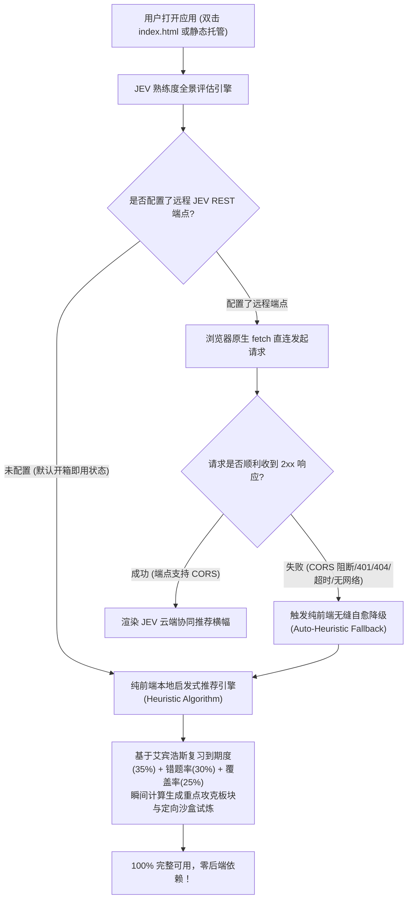

# 零后端纯前端独立运行与自愈降级架构规约 (Zero-Backend Pure Client Spec)

## 1. 核心设计哲学 (Core Philosophy)

Knowledge Arena 遵循企业级 **Frontend Architecture Core 2.1 - lightweight-web Profile** 规范：
- **纯静态便携单文件**：整个应用核心交付物为单文件 `index.html`，支持在任何设备上**直接双击打开（`file:///`）即用**；
- **零后端依赖 (Zero-Backend Dependency)**：系统严禁强依赖任何本地 Node.js 进程、代理中间件或外部服务端即可实现全部功能闭环；
- **极致本地韧性与智能自愈 (Local First & Auto-Heuristic Fallback)**：所有核心算法（SM-2 调度、同胞干扰项采样、Markdown AST 解析、掌握度全景评估与推荐、AI Agent 仿真运行）**100% 在浏览器客户端内存中原生完成**。

---

## 2. JEV 模块的纯前端去后端化架构

针对用户此前反馈的远程跨域（CORS）与代理阻断问题，系统彻底重构为**纯前端无后端自闭环模型**：

### 2.1 纯前端本地启发式多维风险矩阵模型
本地算法运行在客户端，无需网络与后端：
$$\text{RiskScore} = 0.35 \times \text{DueRatio} + 0.30 \times \text{MistakeRatio} + 0.25 \times \text{UnlearnedRatio} + 0.10 \times \text{UnmasteredRatio}$$
- 综合评估：到期危机、同胞混淆盲区、拓荒覆盖度；
- 输出成果：目标分类 ID、紧急度级别（HIGH/MEDIUM/LOW）、人类可读攻克理由、一键直达沙盒试炼。

### 2.2 彻底解绑本地代理后端
- 移除了此前在客户端强制改写请求到 `localhost:3000/api/proxy` 的强后端依赖；
- 远程接口采用原生纯前端直连；
- 若远程接口未配置 CORS 标头，浏览器底层拦截时，系统**绝不抛出阻断性红字异常**，而是**捕获异常并优雅提示，无缝自愈回退到纯前端本地启发式引擎**。

---

## 3. AI Agent 纯前端仿真与独立自闭环

- 在 [`features/ai-agent/client.js`](file:///d:/D/Notes/资料/知识巩固/Game/features/ai-agent/client.js) 中，同步移除向 `/api/proxy` 的强重写；
- 当用户未配置外部 API Key 时，AI Agent **自动启用纯前端内置的仿真推理流水线 (Simulation Mode)**，本地模拟多步工具调用（题库体检、创建学科库、补齐同胞混淆项等），保证纯前端单文件开箱即玩！

---

## 4. 交付与门禁验证

1. **单文件产物**：构建产物 [`index.html`](file:///d:/D/Notes/资料/知识巩固/Game/index.html) 保持在 409.9 KB，内嵌全部核心模块；
2. **离线双击可用**：完全无需运行 `node` 或任何 `.bat` 脚本，双击 `index.html` 即可畅通运行；
3. **架构门禁**：全量 15 项企业架构门禁与 8 项单元测试 **100% PASS**。
