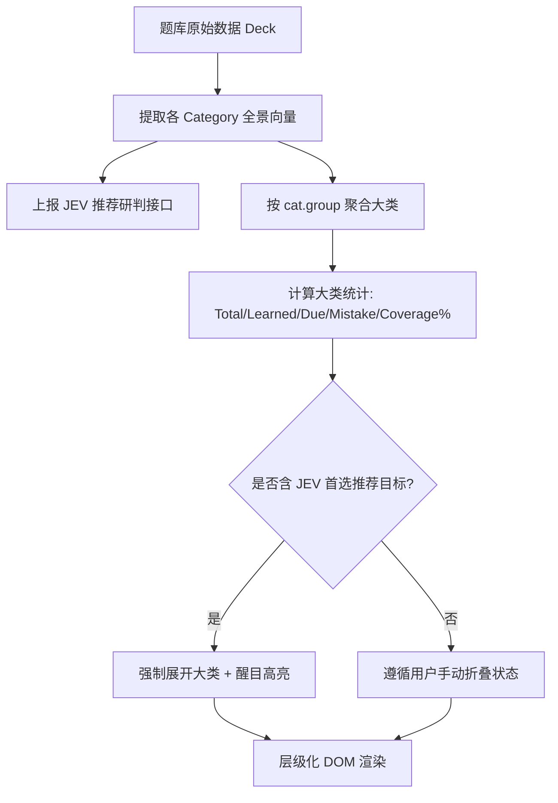

# 各分类板块熟练度全景层级化重构规范与架构门禁 (Panorama Hierarchical Groups Spec)

> **标准编号**：`FE-PANORAMA-001`  
> **受检版本**：`v2.9+`  
> **状态**：`ACTIVE`  
> **适用域**：`Dashboard 仪表盘` / `Review Board 知识档案` / `JEV 熟练度全景雷达`

---

## 一、背景与问题调研 (Root Cause & Problem Statement)

### 1.1 现状缺陷诊断
在原版本中，仪表盘首页核心区域的 **“各分类板块熟练度全景”**（`#deck-category-bars`）采用一维扁平列表渲染各个细分类别（Category）：
- **认知层级丢失**：每个题库在知识图谱规范（`FE-KNOW-005`）中均具有清晰的三维本体架构（`Deck -> Group(大类) -> Category(小类) -> Layer(认知层级) -> Entity(考点条目)`）。然而在全景视图中，所有小类平铺直叙，用户无法快速建立知识的大框架与归属关系；
- **宏观熟练度黑盒**：用户无法直观获取某一个宏观知识体系大类（如“不规则动词核心记忆法”或“客户端与服务端异常族”）的综合掌握率、大类待复习汇总与大类历史错题数；
- **视觉扫描负荷过重**：随着题库规模扩大至 10~25 个细分类别，扁平的长列表会导致页面过长、滚屏疲劳，且缺乏层级收纳与折叠能力。

### 1.2 架构改造目标
1. **建立大类（Group）与小类（Category）的双层树状视觉层级**；
2. **大类提供宏观统计聚合**：包含大类名称、小类数量、总词条数、大类综合掌握率进度条、大类待复习与错题统计；
3. **小类保持微观纵深与 JEV 联动**：在大类容器内优雅缩进呈现，高亮保留 JEV 首选推荐徽标；
4. **支持可折叠与一键统览交互**：大类头部点击可自由折叠/展开，顶栏提供“全部折叠/全部展开”一键切换；当 JEV 命中某小类时，其所属大类强制智能展开并高亮，确保核心研判不被遗漏。

---

## 二、架构设计与数据模型 (Architecture & Data Model)

### 2.1 聚合计算向量模型



### 2.2 大类数据聚合定义
```typescript
interface PanoramaGroup {
  name: string;               // 大类名称 (如: "一、规则变形与读音规律")
  categories: PanoramaItem[]; // 所属小类全景数组
  total: number;              // 大类总词条数
  learned: number;            // 大类已学词条数
  mastered: number;           // 大类永久掌握 (Lv>=4) 数
  dueCount: number;           // 大类今日待复习总数
  mistakeCount: number;       // 大类历史错题总数
  coveragePercent: number;    // 大类综合覆盖掌握率 (0~100)
  hasTarget: boolean;         // 是否包含 JEV 首选推荐目标
}
```

---

## 三、UI 交互与排版规范 (UI/UX Ergonomics Spec)

### 3.1 大类容器 (Macro Group Header)
- **容器材质**：采用 Surface-Card 阶梯底色（`bg-slate-900/60 border border-slate-800 rounded-xl overflow-hidden`）；
- **包含 JEV 推荐时**：高亮边框与柔光辉光（`border-indigo-500/60 ring-1 ring-indigo-500/30`）；
- **头部交互**：鼠标悬停微显高亮（`hover:bg-slate-850/80`），点击整栏切换展开/折叠；
- **折叠箭头动画**：顺时针展开向下（`rotate-0`），收起向右（`-rotate-90`），平滑过渡（`transition-transform duration-200`）；
- **单色矢量图标**：严禁 Emoji，统一采用 `currentColor` 单色矢量 SVG 图标（`FE-ICON-002`）。

### 3.2 小类子卡片 (Subcategory Item)
- **子卡片排布**：位于展开的大类容器内部，具有轻量背景（`bg-slate-900/90`）与微弱边框；
- **视觉前缀**：展示子节点层次微点（常规为中性色 `bg-slate-600`，JEV 推荐目标为靛蓝脉冲 `bg-indigo-400 animate-ping`）；
- **指标对齐**：右侧等宽等高字体展示 `到期: X`、`错题: Y`、`已学/总数 (Z%)`，底部配置平滑渐变进度条。

### 3.3 全局快捷控制
- 在“各分类板块熟练度全景”卡片标题右侧增设 **“全部折叠 / 全部展开”** 快捷按钮（`#panorama-collapse-toggle-btn`），实时同步当前状态标签。

---

## 四、架构门禁标准 (Architecture Gate: FE-PANORAMA-001)

在 `gates/run-gates.mjs` 中增设静态与动态双重门禁：
1. **聚合不变量**：`renderDeckCategoryBars` 必须按 `cat.group` 进行聚合，禁止输出非层级扁平结构；
2. **交互契约不变量**：`KnowledgeMasterApp` 必须实现 `togglePanoramaGroup` 与 `toggleAllPanoramaGroups`，且绑定于 DOM 无报错；
3. **JEV 穿透展开不变量**：当存在 `highlightTargetId` 时，对应大类必须强制展开，禁止处于收起状态；
4. **UI 纯洁性**：100% 保持单色矢量 SVG 规范，绝对零彩色 Emoji。
