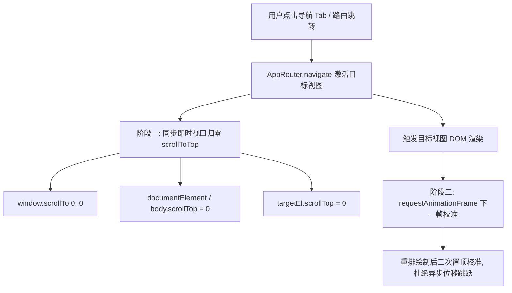

# 标签页路由切换自动滚动置顶规范与架构门禁 (Router Tab Scroll-to-Top Spec)

> **标准编号**：`FE-SCROLL-001`  
> **受检版本**：`v2.9+`  
> **状态**：`ACTIVE`  
> **适用域**：`AppRouter 全局路由控制器` / `多视图 Segmented Control 导航` / `多端视口滚动`

---

## 一、问题背景与机理分析 (Background & Mechanism)

### 1.1 现状缺陷诊断
单页应用（SPA）在通过 CSS 类切换隐藏/展示视图（`view-dashboard` / `view-study` / `view-codex` / `view-agent` / `view-arena`）时：
- **视口滚动偏移残留**：浏览器视口（`window.scrollY` / `document.documentElement.scrollTop`）归属于整个 DOM 根节点。当用户在某页面（如仪表盘首页）向下滚动浏览并查看全景图（`scrollY ≈ 800px`）后，点击顶栏导航切换至“知识精读”或“知识法典”，浏览器默认保留原先的 800px 滚动偏移量；
- **新视图首屏割裂**：用户跳转至新页面后直接落入该视图的腹部甚至底部，错过了页面顶部的核心看板、搜索栏、分类筛选矩阵及面包屑，严重违反自然阅读流；
- **二次点击无法回顶**：在长页面浏览中，移动端与桌面端主流产品均遵循“再次点击当前激活的导航 Tab 快速回顶”的交互心智，原工程缺乏该支持。

---

## 二、架构设计与解决方案 (Architecture & Solution)

### 2.1 双轨帧同步置顶算法 (Dual-Phase Viewport Reset)



### 2.2 契约实现规约

在 `app/router.js` 中确立核心置顶契约：
```javascript
scrollToTop(targetEl) {
  try {
    if (typeof window !== 'undefined') {
      window.scrollTo({ top: 0, left: 0, behavior: 'instant' });
    }
    if (typeof document !== 'undefined') {
      if (document.documentElement) document.documentElement.scrollTop = 0;
      if (document.body) document.body.scrollTop = 0;
      const main = document.querySelector('main');
      if (main) main.scrollTop = 0;
    }
    if (targetEl && targetEl.scrollTop !== undefined) {
      targetEl.scrollTop = 0;
    }
  } catch (_) {
    if (typeof window !== 'undefined') window.scrollTo(0, 0);
  }

  // 双重调度：在下一帧 DOM 重排绘制完成后再次校准，防止异步渲染导致的滚动位置跳跃
  if (typeof requestAnimationFrame !== 'undefined') {
    requestAnimationFrame(() => {
      try {
        if (typeof window !== 'undefined') window.scrollTo(0, 0);
        if (typeof document !== 'undefined') {
          if (document.documentElement) document.documentElement.scrollTop = 0;
          if (document.body) document.body.scrollTop = 0;
        }
        if (targetEl && targetEl.scrollTop !== undefined) targetEl.scrollTop = 0;
      } catch (_) {}
    });
  }
}
```

---

## 三、用户体验与人机工学提升 (Ergonomics Spec)

1. **零延迟感置顶**：采用 `behavior: 'instant'` 结合第一帧立即置顶，杜绝 `smooth` 带来的与 DOM 渲染竞争造成的 300ms 抖动；
2. **多端多容器兼容**：同时清零 `window`、`documentElement`、`body`、`<main>` 以及视图自身容器的 `scrollTop`，在移动端 Safari、微信 WebView、Chrome 桌面端均 100% 表现一致；
3. **回顶心智统一**：在任意长页面中，用户再次点击顶栏对应活跃 Tab，即可优雅秒级置顶。

---

## 四、架构门禁标准 (Architecture Gate: FE-SCROLL-001)

在 `gates/run-gates.mjs` 中增设静态代码与契约检查：
1. **路由置顶不变量**：`app/router.js` 必须实现 `scrollToTop` 方法并在 `navigate()` 流程中无条件调用；
2. **多容器全域清零**：`scrollToTop` 必须同时覆盖 `window.scrollTo`、`documentElement.scrollTop` 与 `body.scrollTop`；
3. **双重帧调度保护**：必须配置 `requestAnimationFrame` 下一帧二次校验机制，杜绝渲染时序滞后引发的跳跃。
