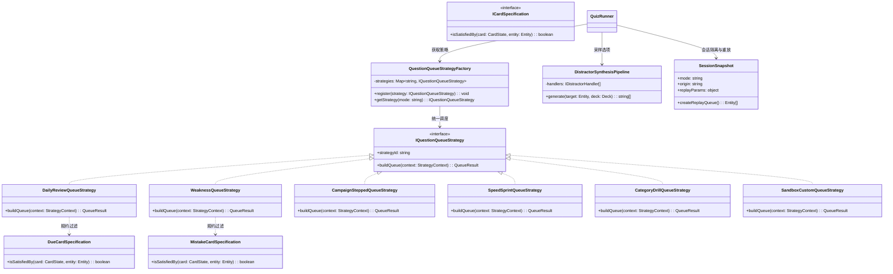

# 各模式题库来源重构与设计模式规约 (Question Bank Source Design Patterns Spec)

> **文档标识**：`27_QUESTION_SOURCE_DESIGN_PATTERNS_SPEC.md`  
> **所属版本**：v2.5+ (题库调度策略引擎与干扰项管道)  
> **关联模块**：`shared/question-strategies/`、`features/arena/quiz-runner.js`、`features/arena/sandbox-config.js`、`shared/distractor-sampler.js`、`shared/sm2-scheduler.js`、`docs/27_question_source_preview.html`

---

## 一、背景与现存架构痛点总结

在前期对系统题库来源方案的源码级调研中，发现了多处影响用户心智、题序质量与架构扩展性的严重逻辑缺陷（详见前期调研报告）。核心痛点集中在以下五个维度：

```
                    ┌────────────────────────────────────────────────────────┐
                    │               题库来源与生成四大核心痛点               │
                    └───────────────────────────┬────────────────────────────┘
                                                │
         ┌───────────────────┬──────────────────┴────────────────────┬───────────────────┐
         ▼                   ▼                                       ▼                   ▼
  【1. 硬编码分支散乱】  【2. 判定标准定义脱节】                  【3. 语义与形态失配】   【4. 会话状态交叉污染】
  prepareQueue 内部     Dashboard、角标、智能横幅与               同胞采样无视语法形态    沙盒分层模式穿透
  大量 if-else 硬编码   弱点出题对“错题”判定公式不同            -ing 题混入 -ed 选项    主战役关卡晋级；
  扩展新模式违背 OCP     无错题时兜底前10题致提示死代码          退火对非英语拼+s/+ed    “再来一局”丢失专项范围
```

1. **出题策略缺乏统一抽象（违背单一职责与开闭原则）**：
   - 题目筛选与排序逻辑散落在 `quizRunner.prepareQueue`、`sandboxConfig.buildQueue`、`main.js`（`drillGroup`/`drillCategory`）等多处，缺乏统一的契约抽象；
2. **错题与到期判定标准口径冲突（数据不一致）**：
   - Dashboard 判定条件：`wrong > 0 && (wrong/attempts > 0.3 || level <= 1)`；
   - 弱点出题条件：`wrong > 0 && level < 3`；
   - 沙盒弱点模式：全量排序无 `wrong > 0` 过滤；
   - 当用户错题数为 0 时，系统不是提示“无弱点词条”，而是强行抽取题库前 10 题（且未打乱），让“无题目提示”沦为死代码；
3. **极速模式与每日复习题量上限失控（体验断层）**：
   - 每日复习面对海量积压词条时无上限截断，引发严重认知过载；
   - 极速生存模式固定截断为 15 题，无法体现无尽生存与冲榜；
4. **干扰项采样语义与规则失配（考查无效化）**：
   - 同分类下不同语法形态条目混采，导致问“-ing”选项却多为“-ed”，一眼即能秒杀；
   - 规范中的 `confusedWith`（强混淆关联）与 `presetDistractors` 在代码中完全丢失未读取；
   - 二级退火对 HTTP、Python 等非语言题库硬编码拼接 `+s`/`+ed`，产生荒谬伪项；
5. **沙盒自测与主线天梯耦合穿透（状态污染）**：
   - 沙盒选择 `STEPPED` 会指派 `CAMPAIGN` 模式，导致结算时意外触发主线天梯的晋级弹窗并解锁 Tier 关卡；
   - 专项速刷答完点击“再来一局”时，上下文参数丢失，退化为全库随机。

为了彻底根治上述问题，本规约引入经典**面向对象与函数式混合设计模式**，对题库来源调度体系与选项生成机制进行全面重构。

---

## 二、架构设计模式选型与协作拓扑

本方案综合运用以下 5 大设计模式，形成正交、解耦、高扩展的题目生成引擎：



### 1. 策略模式 (Strategy Pattern)
* **应用场景**：将各游戏模式（艾宾浩斯复习、弱点攻坚、阶梯天梯、极速生存、专项速刷、自由沙盒）的题库筛选与排序算法封装为独立策略类。
* **收益**：消除 `quiz-runner.js` 与 `sandbox-config.js` 中的冗长 `if-else` 分支；新增自定义模式无需修改调度器核心代码。

### 2. 工厂 / 注册表模式 (Factory / Registry Pattern)
* **应用场景**：通过统一的 `QuestionQueueStrategyFactory` 管理策略实例，支持模式别名归一化（如 `daily`、`daily_review` 映射至同一策略），并支持动态注册自定义插件策略。
* **收益**：集中策略创建逻辑，统一模式命名规范。

### 3. 规约模式 (Specification Pattern)
* **应用场景**：针对“错题 (Mistake)”、“到期 (Due)”、“生锈 (Rusty)”与“已掌握 (Mastered)”建立统一定义对象。
* **收益**：Dashboard 看板、顶部导航角标、智能推荐横幅、竞技场出题 100% 共享相同的判断公式，彻底终结多端口径不一致的隐患。

### 4. 责任链 / 管道模式 (Pipeline Pattern)
* **应用场景**：四选一干扰项采样器重构为 4 级合成管道：
  1. `PresetAndStrongConfusionHandler`（预设与强混淆关联实体注入）；
  2. `FormPreservingSiblingHandler`（同分类且保留语法形态/考查维度的同胞采样）；
  3. `DomainAdaptiveFallbackHandler`（根据知识库领域自适应退火，杜绝给非英语词条追加拼音/英文后缀）；
  4. `FisherYatesShuffler`（最终洗牌与选项截取）。
* **收益**：题目选项具备真正的高诱惑辨析价值，彻底解决考 -ing 却混入 -ed 的“一眼秒杀”缺陷。

### 5. 快照与状态隔离模式 (Snapshot & Session Isolation Pattern)
* **应用场景**：
  * 沙盒分层自测打上独立标记 `{ origin: 'sandbox', allowLadderPromotion: false }`，与主线战役的天梯晋级逻辑强隔离；
  * 专项速刷保存会话快照（包含当前大组/分类/层级上下文与筛选参数），使“再来一局 (`replayCurrentMode`)”能够精准复现原题源。

---

## 三、各模式题库来源重构方案设计

### 1. 规约定义：彻底统一状态判定口径 (`shared/question-strategies/specifications.js`)

```javascript
/**
 * 统一卡片状态业务规约 (Specification Pattern)
 */

// 统一错题判定规约：发生过失误且错误率较高或掌握度极低
export const MistakeCardSpecification = {
  isSatisfiedBy(card) {
    if (!card || card.attempts === 0 || !card.wrong) return false;
    const errorRate = card.wrong / card.attempts;
    // 错误次数 > 0，且 (错误率 >= 25% 或 仍处于 Level 0/1 浅层记忆)
    return card.wrong > 0 && (errorRate >= 0.25 || (card.level || 0) <= 1);
  }
};

// 统一艾宾浩斯到期判定规约
export const DueCardSpecification = {
  isSatisfiedBy(card, targetTimestamp = Date.now()) {
    if (!card || !card.nextReviewAt) return false;
    const endOfDay = new Date(targetTimestamp).setHours(23, 59, 59, 999);
    return card.nextReviewAt <= endOfDay;
  }
};

// 记忆生锈判定规约 (逾期超过稳定期的2倍)
export const RustyCardSpecification = {
  isSatisfiedBy(card, targetTimestamp = Date.now()) {
    if (!this.isDueCard(card, targetTimestamp)) return false;
    const overdueMs = targetTimestamp - card.nextReviewAt;
    const stabilityMs = (card.stabilityDays || 1) * 24 * 3600 * 1000;
    return overdueMs > stabilityMs * 2;
  },
  isDueCard: DueCardSpecification.isSatisfiedBy
};
```

---

### 2. 策略契约与工厂实现 (`shared/question-strategies/strategy-factory.js`)

```javascript
/**
 * 题目来源队列策略契约与工厂
 */

export class QuestionQueueStrategyFactory {
  constructor() {
    this.strategies = new Map();
    this.aliases = new Map();
  }

  register(strategyId, strategyInstance, aliases = []) {
    this.strategies.set(strategyId.toUpperCase(), strategyInstance);
    aliases.forEach(alias => {
      this.aliases.set(alias.toUpperCase(), strategyId.toUpperCase());
    });
  }

  getStrategy(modeName) {
    const raw = (modeName || 'DEFAULT').toUpperCase();
    const targetId = this.aliases.get(raw) || raw;
    const strategy = this.strategies.get(targetId);
    if (!strategy) {
      console.warn(`[StrategyFactory] 未知模式 "${modeName}"，自动降级为默认自测策略`);
      return this.strategies.get('DEFAULT');
    }
    return strategy;
  }
}
```

---

### 3. 六大具体出题策略设计

#### 策略 1：每日艾宾浩斯复习策略 (`DailyReviewQueueStrategy`)
* **排队算法**：
  1. 使用 `DueCardSpecification` 过滤当前题库；
  2. **绝对禁止伪兜底**：若到期题量为 0，直接返回空数组 `[]`，由运行器优雅弹出完成提示；
  3. **防疲劳上限截断**：按逾期紧迫度（越早到期越优先）或随机打乱，安全截取上限（默认 20 题，允许配置 15~30 题）；
  4. 答错重现闭环：答错条目在本次复习队列末尾重新入队一次，直至答对。

#### 策略 2：弱点歼灭战策略 (`WeaknessQueueStrategy`)
* **排队算法**：
  1. 使用 `MistakeCardSpecification` 过滤出真实错题；
  2. 若错题数为 0，返回 `[]`，触发“太棒了！当前暂无错题待消灭”鼓励反馈；
  3. 排序权重算法：
     $$\text{Weight} = \text{card.wrong} \times 2.0 + (3 - \text{card.level}) \times 1.5 + (\frac{\text{card.wrong}}{\text{card.attempts}}) \times 10$$
     按权重降序排列，优先爆破顽疾盲区；
  4. 题量截取：取前 15 题（若错题不足 15 题则取全部错题）。

#### 策略 3：分层阶梯战役策略 (`CampaignSteppedQueueStrategy`)
* **排队算法**：
  1. 锁定目标认知层级（`targetLayer`，默认为当前激活 Tier 对应的 Layer 1/2/3）；
  2. 提取该层级所有条目，在层级内部执行 Fisher-Yates 随机洗牌；
  3. 截取固定配额 8 题；
  4. 附带主线天梯元数据：`{ allowPromotion: true, tier: targetTier }`。

#### 策略 4：极速生存策略 (`SpeedSprintQueueStrategy`)
* **排队算法**：
  1. 获取当前范围全量条目，充分随机乱序；
  2. 模式类型声明为 `isEndless: true`（无尽或大题量 50 题）；
  3. 阵亡机制支持：当生命值为 0 时，结算展示“生命耗尽 (Game Over)”专属界面与音效，而非误播通关胜利音效；分母仅统计实际已答题数。

#### 策略 5：专项速刷策略 (`CategoryDrillQueueStrategy`)
* **排队算法**：
  1. 支持维度下钻：大组（Group）、分类（Category）、层级（Layer）或单题（Single）；
  2. 保留完备的上下文快照：`{ filterType: 'category', filterValue: 'CAT_IC_SPECIAL' }`；
  3. “再来一局”时直接复用该快照重新洗牌出题，彻底解决退化为全库随机的 Bug。

#### 策略 6：自由沙盒混合策略 (`SandboxCustomQueueStrategy`)
* **排队算法**：
  1. 按照 `selectedCategories` 与 `selectedLayers` 计算交集候选池；
  2. 挂接四大子规则（DEFAULT、WEAKNESS、STEPPED、SPEED_SPRINT）；
  3. 分层模式保持层级递进（Layer 1 $\to$ 2 $\to$ 3），并在**相同层级内部进行乱序**（解决旧版同层顺序僵死问题）；
  4. 显式打上 `{ origin: 'sandbox', allowPromotion: false }`，绝对不穿透触发主线战役晋级。

---

### 4. 干扰项合成管道模式设计 (`shared/distractor-sampler.js`)

针对旧版同胞采样“跨形态乱选”与“荒谬伪项”的问题，建立四阶段责任链管道：

```
                    ┌────────────────────────────────────────────────────────┐
                    │               干扰项合成管道 (Distractor Pipeline)     │
                    └───────────────────────────┬────────────────────────────┘
                                                │
                                                ▼
         ┌────────────────────────────────────────────────────────────────────────┐
         │ Stage 1: 强混淆对与人工预设项注入 (Strong Confusion / Preset Injector) │
         │ • 优先读取 target.presetDistractors (若存在)                            │
         │ • 优先注入 target.confusedWith 对应实体的答案 (激活高价值强混淆对)     │
         └──────────────────────────────────────┬─────────────────────────────────┘
                                                │ 需补足至 3 个干扰项
                                                ▼
         ┌────────────────────────────────────────────────────────────────────────┐
         │ Stage 2: 同形态/同维度约束的同胞池采样 (Form-Preserving Sibling Sampler)│
         │ • 针对动词题库：若考核 -ing，同胞池严格过滤答案同为 -ing 的条目        │
         │ • 针对概念题库：同分类同胞优先抽取，拒绝跨概念无关干扰                │
         └──────────────────────────────────────┬─────────────────────────────────┘
                                                │ 仍不足 3 个干扰项 (退火)
                                                ▼
         ┌────────────────────────────────────────────────────────────────────────┐
         │ Stage 3: 领域感知自适应退火兜底 (Domain-Adaptive Fallback Sampler)     │
         │ • 语言类：使用形态变异生成器 (如 double consonant / silent e / -ic加k) │
         │ • 概念/代码类：退火至同层级其他分类概念，严禁无意义拼接 "+ed"/"+s"    │
         └──────────────────────────────────────┬─────────────────────────────────┘
                                                │
                                                ▼
         ┌────────────────────────────────────────────────────────────────────────┐
         │ Stage 4: 数组洗牌与四选一截取 (Fisher-Yates Shuffler)                   │
         │ • 合并正确答案与 3 个优质干扰项，随机乱序绑定 1/2/3/4 快捷键           │
         └────────────────────────────────────────────────────────────────────────┘
```

#### 管道阶段核心实现规约

```javascript
export class DistractorSynthesisPipeline {
  static generate(targetEntity, allEntities, deck) {
    if (!targetEntity) return [];
    const correctAnswer = targetEntity.answer.trim();
    const distractors = new Set();
    const isLang = isLanguageDeck(deck);

    // Stage 1: 预设与强混淆实体注入
    if (Array.isArray(targetEntity.presetDistractors)) {
      targetEntity.presetDistractors.forEach(d => {
        if (d && d.trim() !== correctAnswer && distractors.size < 3) distractors.add(d.trim());
      });
    }
    if (distractors.size < 3 && targetEntity.confusedWith) {
      const confusedEntity = allEntities.find(e => e.id === targetEntity.confusedWith);
      if (confusedEntity && confusedEntity.answer && confusedEntity.answer.trim() !== correctAnswer) {
        distractors.add(confusedEntity.answer.trim());
      }
    }

    // Stage 2: 同形态约束的同胞池采样
    if (distractors.size < 3) {
      const siblings = allEntities.filter(e => {
        if (e.categoryId !== targetEntity.categoryId || e.id === targetEntity.id || !e.answer) return false;
        const ans = e.answer.trim();
        if (ans === correctAnswer || distractors.has(ans)) return false;

        // 语言题库：形态/后缀对齐过滤（考 -ing 只选 -ing，考 -ed 只选 -ed）
        if (isLang) {
          if (correctAnswer.endsWith('ing') && !ans.endsWith('ing')) return false;
          if (correctAnswer.endsWith('ed') && !ans.endsWith('ed')) return false;
        }
        return true;
      }).sort(() => Math.random() - 0.5);

      for (const s of siblings) {
        if (distractors.size >= 3) break;
        distractors.add(s.answer.trim());
      }
    }

    // Stage 3: 领域感知自适应退火
    if (distractors.size < 3) {
      if (isLang) {
        // 针对动词生成高仿语法陷阱变体
        const traps = generateGrammarTraps(correctAnswer);
        for (const t of traps) {
          if (distractors.size >= 3) break;
          if (t !== correctAnswer) distractors.add(t);
        }
      } else {
        // 非语言题库：从同层其他分类借用真实概念答案
        const sameLayerOthers = allEntities.filter(e => 
          e.id !== targetEntity.id && e.layer === targetEntity.layer && e.answer.trim() !== correctAnswer && !distractors.has(e.answer.trim())
        ).sort(() => Math.random() - 0.5);

        for (const o of sameLayerOthers) {
          if (distractors.size >= 3) break;
          distractors.add(o.answer.trim());
        }
      }
    }

    // Stage 4: 洗牌
    const options = [correctAnswer, ...Array.from(distractors).slice(0, 3)];
    return shuffleOptions(options);
  }
}
```

---

## 四、技术可行性分析与架构合规推演

### 1. 物理目录与模块依赖合规性 (`FE-STRUCT` & `FE-IMP`)
- 新增策略类与工厂放置在 `shared/question-strategies/` 目录下；
- 遵循 Core 2.1 依赖单向不变性：`features/arena` 依赖 `shared/question-strategies`，`shared` 不依赖任何上层 feature，完全满足 `FE-IMP-002`（零反向依赖）；
- 单文件行数预算：每个策略类代码量在 40~60 行之间，工厂类约 50 行，管道类约 80 行，严格符合 `FE-QUALITY-001`（$\le 300$ 行限制）。

### 2. 纯客户端零后端与本地持久化兼容性 (`20_ZERO_BACKEND`)
- 全部策略与规约采用纯内存同步计算，无任何网络开销与外部进程依赖；
- 用户已有学习进度（`DeckState.cards`）数据结构完全无需更改，百分之百向后兼容；
- 导入导出备份（JSON）保持原样平滑恢复。

### 3. 质量门禁与测试用例扩展性 (`FE-TEST`)
- 在 `tests/unit/` 下新增 `question-strategies.test.mjs`，覆盖：
  1. 到期与错题数为 0 时的空队列安全防御；
  2. 极速模式与每日复习上限截断有效性；
  3. 沙盒分层自测与主线天梯解锁的隔离断言；
  4. 干扰项管道同形态约束与强混淆对注入断言；
  5. 专项速刷会话快照与“再来一局”还原断言。

---

## 五、方案预览沙盒设计与说明 (`docs/27_question_source_preview.html`)

为了让架构决策、出题效果与逻辑修复能够被直观检视与演练，同步构建了专属交互预览工作台：

1. **题库切换与上下文装配**：可在动词题库、HTTP 状态码题库、Python 内存模型题库间瞬时切换；
2. **策略运行实时仿真器**：
   - 交互式切换 6 大出题策略，实时观察匹配到的条目、排序过程、配额截取与生成的队列；
   - **极端边界注入测试**：一键模拟“0 错题”、“0 到期”、“100 题超长积压”、“沙盒分层自测”等场景，直观验证是否还会发生旧版 Bug；
3. **干扰项合成管道对照比对台**：
   - 输入目标概念（如 `panic (变-ing)` 或 `401 Unauthorized`）；
   - 并排展示【旧版算法生成的选项（存在跨时态破绽或拼接+ed）】与【新版 Pipeline 生成的选项（同形态对齐+强混淆注入）】，对比选项质量；
4. **架构设计模式全景交互面板**：提供清晰的模式交互流程、调用链与职责分工说明。
